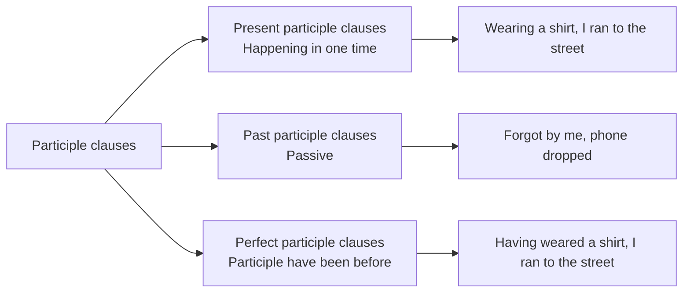

#Rules
Грубо говоря, это деепричастия.
While I was waiting for Ellie, I made some tea → Waiting for the Ellie, I made some tea

!Participle clauses we need to separate from other part of sentences with comma.

There is a good difference between perfect and present.

With that clauses we can use: on, instead of, in spite of, while, when

Чтобы понять можем ли мы сформировать эту грамматическую конструкцию, мы сначала должны убрать предлог, а затем проверить относится ли предложение и clause к одному подлежащему. Если да, то все хорошо.\

Past participle позволяет заменять конструкции с which:
- Found in a litter bin, the briefcase contained classified information