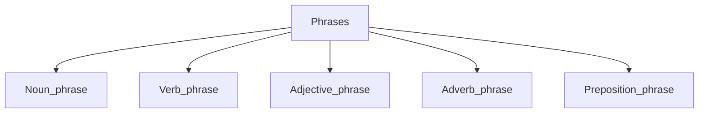

[[English grammar]]
Phrases in English is [[aggregate]] of words(or one word), which form [[meaningful]] grammatical unit [[within the boundaries]] of a [[clause]].

 
1. [[Noun_phrase|Noun phrase]]
2. [[Verb_phrase]] 
Synonym in some cases: [[collocation]].