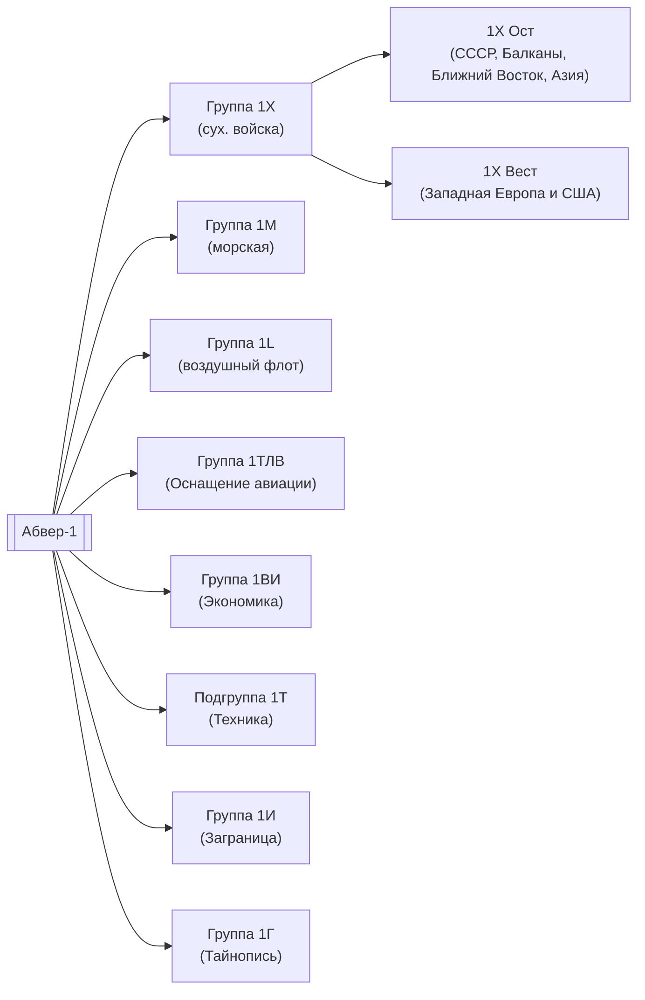

Руководство:
1. Полковник Пиккенброк(1936-1943)
2. Полковник Ханзен(1943-1944)

1X — разведданные о сухопутных силах
	1. 1X Ост(Полковник Штольц)
	2. 1Х Вест(Полковник Маурер)

1М — разведданные о военно-морских силах.
Начальники:
1. Капитан морской службы Менцель(до 1943)
2. Капитан морской службы Пфейфер

1Л — разведданные о военно-воздушных силах противника. Руководитель — майор Бреде 

1ВИ — сбор данных об экономическом потенциале всех стран мира, количества стратегического сырья. Руководители:
1. Подполковник, доктор Блох(до 1943)
2. Подполковник Фокке

1ТЛВ — разведданные о техническом оснащении авиации. Руководитель — штабс-инженер Гросскопф

Подгруппа 1Т — разведданные о техническом оснащении армии. Руководитель — майор Деннер.

Подгруппа 1И — задачи:
1. Подготовка агентов-радистов
2. Связь с зарубежной агентурой(мощная радиостанция вблизи Берлина)
3. Радиоперехват
4. Снабжение подразделений абвера(всё, что связано с абвером)
Имели завод для производства радиотехники. Начальник — майор Розегорн.

Подгруппа Г — печати, паспорта для абвера; конструирование фотооборудования; разработка чернил(начальник — подполковник Мюллер)

