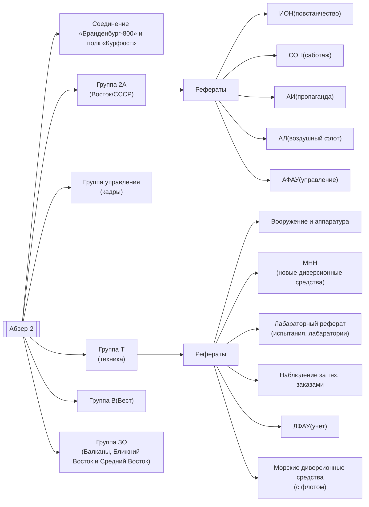

Задачи:
1. Подготовка диверсантов и террористов. Заброска их в тыл противника
2. Разработка и изготовление средств индивидуального террора
3. Организация диверсий и терактов. Создание отрядов из национальных меньшинств
4. Организация формирований из фольксдойче

Руководители:
1. Полковник Гросскурт
2. Генерал-майор Лахузен
3. Полковник Фрейтаг фон Лорингхофен

Группа управления — кадры. Руководитель — майор Абсхаген

Группа 2А — диверсионно-террористические действия против СССР. Начальник — полковник Штольце. Агентами были белогвардейцы и украинские националисты.
Включает:
1. СОН(саботаж Ост-Норд) — диверсии и саботажи в странах Востока и Севера, заброс агентуры в тыл, руководство диверсионными командами и группами Абвера
2. АИ(разложение стран Востока и Севера) — пропаганда в советском тылу и контроль пропаганды в прифронтовых территориях
3. АЛ(воздушный флот) — инструктаж парашютистов и обеспечение команд Абвера самолетами для заброски в тыл
4. ИОН(повстанчество в странах Севера и Востока) — создание повстанческого движения в тылах СССР и руководство фронтовыми органами Абвера. 
	Руководители:
	1) Зондерфюрер доктор Маркерт
	2) Майор Эфлинг(с апреля 1942)
5. АФАУ(управление) — административно-хозяйственные мероприятия

Группа В(Вест) — диверсионно-террористическая  работа против западных стран. Включал 4 реферата
Начальник — майор Астор

Группа ЗО(Зюд-Ост) — диверсионно-террористическая деятельность на Балканах, Ближнем и Среднем Востоке. Руководитель — подполковник Путц

Группа Т — разработка и изготовления оружия, обмундирования и иных средств
Начальники:
1. Полковник Магер
2. Полковник Маурициус
Рефераты:
1. Вооружение и аппаратура — разработка новых видов оружия, аппаратуры и обмундирования, снабжение боевыми средствами диверсантов и террористов. В распоряжении различные склады. Начальник — майор Позер
2. МНН — разработка новых диверсионных средств
3. Лабораторный реферат — курировал физико-химические лаборатории и испытания. Руководитель лаборатории — майор Байерляйн. Заместитель научной части — доктор Кениг. Начальник реферата — майор Эрман
4. ЛФАУ — управление учета.                               Начальник — капитан Шлеф
5. Реферат по наблюдению за выполнению технических заказов. Руководитель — обер-лейтенант Клене