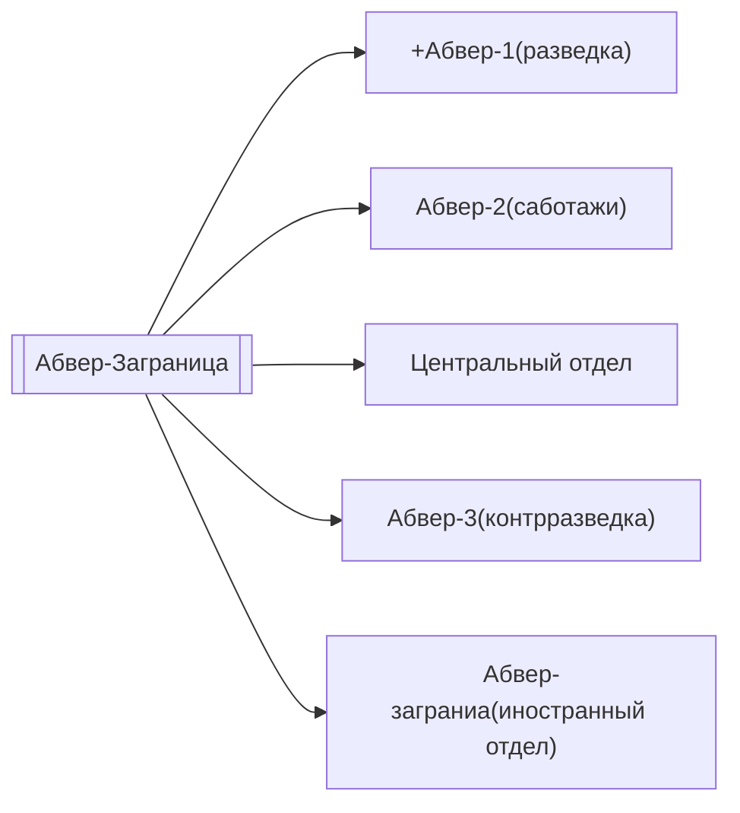

Абвер(в переводе «Отпор» или «Защита») — разведывательный и контрразведывательный орган, образованный в 1919 году. Самостоятельный отдел военного министерства.

Абверштелле — основные приштабные звенья, составные элементы, функционал которых заключался в проведении разведработ.

Руководство:
1. Генерал-майор Гемп(1919-1927)
2. Полковник Швантес(1928-1929)
3. Полковник Бредов(1929-1932)
4. Вице-адмирал Патциг(1932-1934)
5. Адмирал Канарис(1935-1943)
6. Полковник Ханзен(январь-июль 1944)

В 1938 году проходит реорганизация и он входит в состав ОКВ(в будущем как «Абвер-Заграница»).

Подразделялся на:

