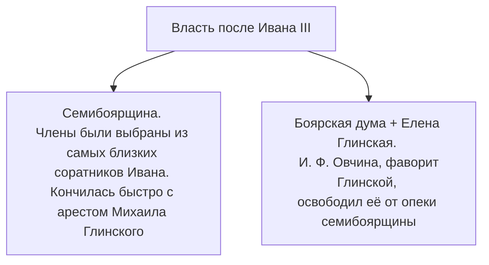
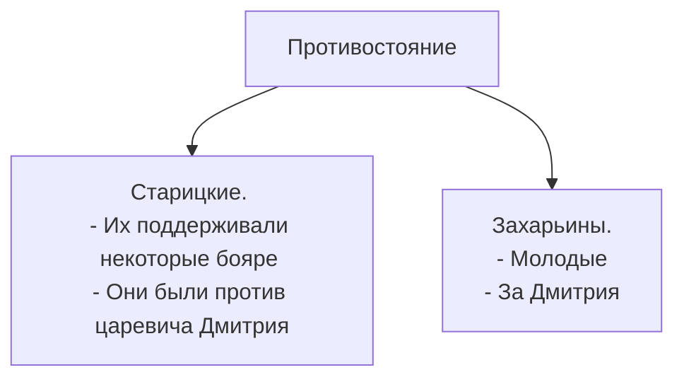

Василий $III$:
1) Первая жена — Соломния Сабурова, дворянка. 20 лет не могла родить, насильно заточена в монастырь.
2) Вторая жена — Елена Глинская. Была достаточно обаятельной, чтобы покорить Василия, заставить сбрить его бороду. Монахи и бояре были против этого брака

Семья жила хорошо, мать была важной фигурой в глазах Ивана, так как отец умер, когда Ивану было 3.

Глинская, освободившись от опеки семибоярщины, совершила гос. переворот. Она вместе с думой провела некоторые важные реформы(денежная как пример), но Елена вскоре скончалась. Сложно сказать от чего, но можно сказать точно: всем её смерть была выгодна.

После смерти Глинской власть опять перешла к семибоярщине, но уже под контролем Шуйских(начали маленькую резню). Они держались некоторое время, пока их не выжили другие бояре. 

После 1453 Русь вышла из тени Византиии и татарских ханов

Иван не любил бояр:
1) Сначала они его гиперопекали, а потом забили, разрешив ему делать всё.
2) Они его использовали в своих целях
3) Они не уважали его мать

Когда Иван зашёл на престол, он начал беспричинные казни(отрезал одному боярину, который что-то плохое сказал про него, язык).

После воцарения Ивана в первое время у руля встали Глинские. Получилось у них не очень, так как их политика потерпела неудачу(поборы и т.д.). В Москве произошло восстание, дворы Глинских разграбили, кого-то убили, царю пришлось бежать. Но, как итог, восстание само успокоилось.
Итог восстания:
- Глинские были разбиты
- Бояре потерпели неудачу и испугались. Помещики, давно недооцененные, вышли на политическую арену
- Адашев вошёл на политическую арену со своими реформами

Царя увлекли:
1) Идеи самодержавия(митрополит Макарий)
2) Идеи реформ(Адашев и избранная рада, которую можно по сути назвать партией реформ)
3) Идеи личной жизни(Сильвестр). Сильвестр — строгий наставник, который учил Ивана жизни.

Реформы избранной рады:
- 1549 — судебник. Усилил бюрократию, ослабил местные вотчины, ускорил земельную реформу
- Создание стрелецких войск
- Ослабление местничества
- Ограничение прав церкви: право на покупку земель, защита от налогообложение. Частично отобраны земли.

Адашев был сторонником экспансии восток:
- Покорение Казани — проект избранной рады. Казань до этого совершала набеги на земли России, продавали её жителей в рабство. После изгнания Шаха Али, сторонника Москвы в Казани, началась война(1545-1552). Вслед за падением Казани последовало присоединение Сибири и Поволжья. 

В 1553 царь очень сильно заболел.

После выздоровления Ивана Старицкие выжили только благодаря Сильвестеру. 
В целом Сильвестр был под покровительством многих влиятельных людей:
- Е.Ф. Горбатый участвовал в осаде Казани и был связан с Курбским
- Д. Курлятев-Оболенский. Бояре

После казанского похода Адашев провёл последние реформы:
- Была оформлена приказная система, где делопроизводством занялись помещики и дворяне
- Началась ликвидация кормлений
- Вотчины и поместья были приравнены в плане службы
- Расширение влияние дворянства

Для Ивана Грозного время реформ — время обучения. Он учился управлять государством из юнца стал образованным человеком среднего возраста.

Но в конце концов царь разочаровался в реформах, ведь они не усилили его власть.
Адашев, проделав путь через Ливонию и проиграв в выборе внешней политике, был брошен в тюрьму, где и умер.
Причины отставки:
- Реформы
- Медленный ход Ливонской войны
- Сильвестр и Адашев косвенно причастны к смерти жены

После смены власти начались пиры, вопреки прошлому, а направление внешней политики окончательно повернуло на Запад.

Иван начал закручивать гайки дворянам:
1. В 1562 принят закон об изменении владения вотчинами: их больше не могли продать или обменять, у вдов и дочерей они забирались в пользу государства. Не затронул этот закон только самые влиятельные рода.
2. В наследство Иван не включил дворянские фамилии, а людей без древнего рода
3. Произошёл инцидент(обоснованные подозрения в измене) с братом, но царь его простил.
4. Начал собирать компромат против своих врагов, включив в архив даже заговор Старицких 
Многие дворяне бежали в Литву, а царь разошёлся ни на шутку. После смерти митрополита Макария нарушился хрупкий мир: начались репрессии, главной фигурой в которых стал Алексей Басманов.

Начались гонения Захарьиных и их родственников, один из которых был членом бывшей избранной рады. 
Были казнены по приказу Басманова двое князей, которые участвовали 
в осаде Пскова, ещё один был взорван.

Началось притеснение и подчинение церкви, не разделившей политики царя.

Курбский был заподозрен в измене(которую и впрямь совершил, выдав ливонских сторонников Москвы), но сбежал.
После отъезда Курбского царь пишет «манифест самодержавия», где обвиняет бояр в измене.

В 1564 распадается окончательно правительство Захарьевых, а бояре и церковь изолируют Грозного. Царь отъезжает в Александровскую Слободу и «отрекается», предварительно провоцируя народ восстать против бояр. Бояре и церковь, находясь под огромным давлением, просят его вернуться на престол — возвращается он уже с опричниной и развязанными руками. Горбатый, лидер боярской думы, получивший высокое положение во времена Адашева, был убит.
Страна разделилась на две части: опричнина обладала личной армией, территориями и двором, а также взяла под контроль торговые центры, центры солевой промышленности. Оставшаяся часть страны была у бояр. На территории опричников конфисковывались земли и вотчины, а заместо них выдавали вотчины меньше, находящиеся вдалеке.
Суздальская знать, противостоявшая долгое время московской, канула.

Опричнина — инструмент противостояния боярам и отъема их владений в виде армии, состоявшей из дворян. Такой, как правило неудавшийся в жизни дворянин, давал клятву лично царю.

В 1572 происходит Земский собор по поводу заключения мира с Польшей, но народ не соглашается. Представители предлагают платить Ивану больше золота на условиях отмены опричнины, но он не соглашается и разгоняет собор. Отказ от реформ

Перед началом масштабного террора царь начал развивать Вологду(столица опричников согласно идеи), хотел даже бежать в Англию.

Против него организовал заговор известный дворянин Челядин, желая посадить его брата на престол заместо Ивана. Ливонский поход отменили: брат выдал Ивану заговорщиков. После этого Иван с большей силой начал бить бояр-плутократов, начинают возвышаться Скуратов. Начинается зачистка недовольных с удвоенной силой.

Ситуация на Руси в 70-х годах:
- Голод и неурожай
- Большие налоги
- Мор

Разгром Новгорода. Причины:
- Участие Новгорода в заговор Челядина
- «Изборская измена». Крепость в Ливонии была сдана предателем, что бросило тень на Новгород и Псков, где начали зачищать неблагонадежных лиц
- Свержение короля Швеции подданными 
По итогом сфальсифицированного судебного процесса(повар) брат Грозного был казнен.
Новгород разграбили, не пожалев ни церкви, ни женщин, ни детей.
Псков избежал жесткой участи, так как там вычистили незадолго до этих трагичных событий. Но Новгородский процесс в итоге перерос в Московский, когда появились недовольные бояре разгромом Новгорода:
лидеры опричнины — князья Басманов и Вяземский — казнены за осуждение разгрома Новгорода и связи со священником Пименом.

В Новгороде под контролем опричников все было печально:
- Денег у народа не было, поэтому платили натуральным трудом
- Появились иностранные концессии
- Зато был порядок и закон, не считая присутствия опричников

Но после смерти Басманова, опричников снова начали судить за разбой и грабёж. Царь начал готовиться к отмене опричинины, изрядно взбесившейся. Формально ей управляли московские бояре, но фактически Скуратов.

Немножко внешней политики:
- Мирные переговоры со Швецией провалились, так как царь не пошёл на небольшие уступки
- Опричнина не смогла сдержать натиск крымчан. Москва пострадала. Крымчанам предлагали Астрахань, но они хотели захватить всю русь. В 1572 году опричники вместе с русской армией отразили атаки объединенной орды. Экспансия востока была предупреждена 
- В 1569 турки попытались захватить Астрахань, но не дошли по степям

Причины постепенной отмены опричнины:
- Царь перестал им доверять
- Они не предотвратили сожжение Москвы
- Объединенная русская армия разбили крымчан
В 1572 Новгород был объединен, административный аппарат начал слияние, начался отъем привилегий и в этом же году вышел указ, запрещающий упоминать опричнину.

Этапы опричнины:
1. Антикняжеская направленность
2. Компромисс
3. Террор 1567-1570
4. Разложение

Итого:
- Боярская дума сильно ослабла
- Цели неорганиченного самодержавия в полной мере не были достигнуты
- Усилились дворяне и бюрократия
- Возникли первые Земские соборы

В 1575 году второе новгородское дело после заговора любимца Ивана. Послеопричное правительство уничтожено, опала на церковь: запрет земельных пожертвований, казни. Отрекся от престола(опять политический ход) в пользу татара, продолжил вторую опричнину. Погромов не было. Возвыcились Бельские, Годуновы, Нагих.

Умер в 1584.