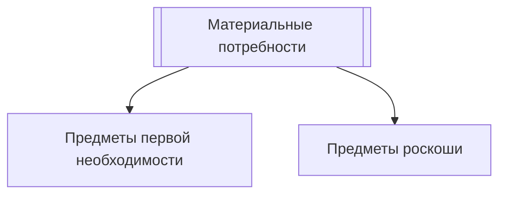

Материальные потребности — это желание потребителей приобрести и использовать товары или услуги. 
Материальные потребности общества безграничны и неутолимы.

```mermaid
graph TB
newLines1["Предметы первой необходимости"]
id1[[Материальные потребности]] --> newLines1
newLines2["Предметы роскоши"]
id1[[Материальные потребности]] --> newLines2
```

