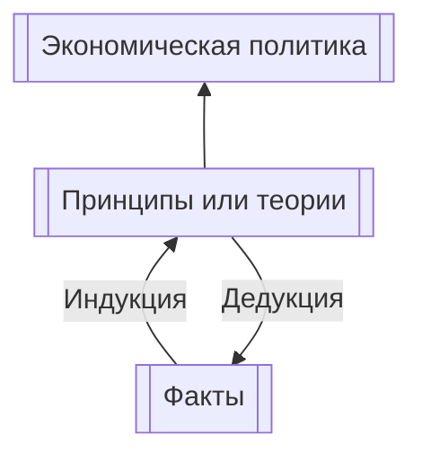
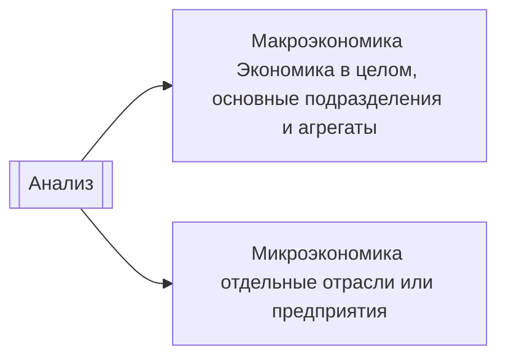

1. Сбор фактов, относящихся к конкретной проблеме, и сопоставление их с гипотезами([[Эмпирическая(описательная) экономика|описательная]] или [[Эмпирическая(описательная) экономика|эмпирическая экономика]])
2. Выработка экономических принципов и теорий при помощи [[Принцип индукции|индукции]] и [[Принцип  дедукции|дедукции]]. Факты приводятся к экономическим принципам, используя индуцирование(приведение от частного к общему). Далее, мы проверяем частные случаи экономическими принципами, опровергая или подтверждая их. Это гипотетический или дедуктивный метод.
3. Из экономического поведения, составленного из принципов и теорий, формируется экономическая политика, то-есть меры для решения или устранения проблемы. Это [[Прикладная экономика|прикладная экономика]]. 

Задача экономической теории — привести в систему, истолковать и обобщить факты. Принципы и теории — конечный результат экономической теории — вносят смысл в набор фактов, выводя из них обобщения. 

Факты всегда могут меняться, поэтому всегда стоит сверять их с экономическими принципами.

### Разработка экономической политики
Шаги:
1) Чёткое определение целей
2) Рассмотрение альтернатив
3) Оценка эффективности и разбор последствий подобной политики в прошлом

### Допущения при рассмотрении объемов производства 
1. Эффективность. Экономика функционирует в условиях полной занятости и достигает полного объема производства.
2. Постоянное количество ресурсов. Имеющиеся факторы производства постоянный как по количеству, так и по качеству
3. Неизменяемая технология. Технология производства принимается постоянной.
4. Два продукта. Всего есть два продукта: потребительские товары и средства производства. 