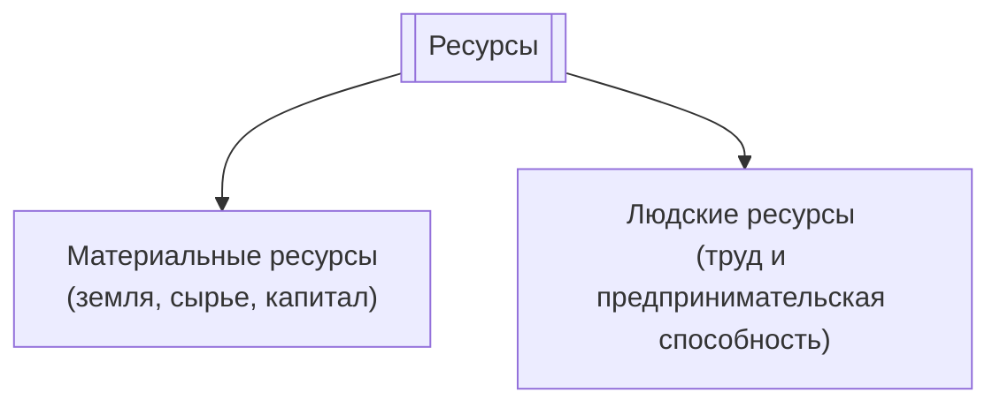

Экономические ресурсы — это средства для производства товаров и услуг. Ограничены и редки.

Экономические ресурсы — это совокупность людских, природных и произведенных человеком ресурсов, которые используются для производства товаров и услуг. 

[[Категории ресурсов(факторы производства)]]:
1. Земля — пахотные земли, полезные ископаемые и т.п.
2. [[Капитал]] — это инвестиционные ресурсы, то-есть все произведенные средства производства.
3. Труд — все физические и умственные способности, применяемые в производстве товаров и услуг.
4. Предпринимательская способность:
	1) Предприниматель — это человек, которые берёт на себя инициативу соединения ресурсов земли, капитала и труда в единый процесс производства товаров и услуг
	2) Предприниматель берет на себя принятие основных решений в процессе развития бизнеса, определяет его направленность
	3) Предприниматель — это новатор, лицо, стремящееся вводить новые продукты, произведенные технологии и формы бизнеса.
	4) Предприниматель — это человек, идущий на риск.

### Плата за ресурсы
[[Рентный доход]] — доход от предоставления сырья и оборудования.
[[Заработная плата]] — доход тех, кто предоставляет труд.
[[Прибыль]] — предпринимательский доход, который может принять форму убытка.