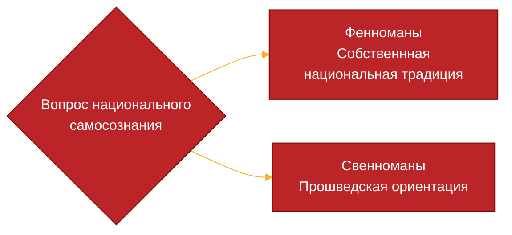

---

---

## Карточка
*___Полное Название__*: Финляндская республика
*___Площадь__*: $338$ тыс. км$^2$
*___Население__*: $5608$ тыс. человек
__*Столица__*: Хельсинки
*___Государственные языки__*: финский и шведский
***
## Географическое положение:
![[Финляндия. Карта.png]]
Государство расположено на севере Европы, а с юга омывается Балтийским морем 
Граничит:
- Россией (1340 км границы)
- Норвегией(727 км границы)
- Швецией (614 км границы)

Рельеф холмисто-равнинный, а самая высокая точка страны, гора Халтиа (1328 м), располагается на границе с Норвегией

Страны славится двумя своими основными природным достояниями:
- Лес. Страна обильно покрыта хвойными лесами ($\frac7{10}$ от всей территории). Состав примерно такой: сосна (45%), ель (37%) и берёза (15%). Они играют важную роль в хозяйственной деятельности страны. 
- Озера. В Финляндии свыше 60 тысяч больших и малых озёр, которые занимают $\frac{1}{10}$ от всех территорий страны. Самое обширное озеро — озеро Сайма на юге страны. Большая часть озёр имеет ледниково-тектоническое происхождение. В целом озёра образуют единые озерные системы с помощью протоков и являются дешевым способом сплавлять лес 

![[Озеро Сайма.png]]
Озеро Сайма

Теплое норвежское течение несколько смягчает климат, но не сильно
Ещё хуже ситуация во внутренних района, где снег держится полгода.

***Изотерма января***: от -11 до -15 градусов Цельсия.
***Изотерма июня***: 13-15 градусов Цельсия
***Годовое количество осадков***: от 400 до 700 мм
***Климатический пояс***: умеренный. Переходный климат от океанического к континентальному, повышенная влажность 

## История
### Период до возникновения финской государственности (н.в. —1917)
Территории нынешней Финляндии традиционно занимали финно-угорские племена, которые однако не смогли сформировать финское государство. Первая финская государственность зародилась во времена шведской колонизации $XII-XIV$ вв. во времена борьбы с Новгородом.

Консолидация финского народа произошла на основе западной традиции. На это повлияло два фактора:
- Новгород почти не занимался хозяйственной колонизацией земель, а только собирал с них дань
- Шведские крестоносцы навязали католичество, в будущем сменившиеся на лютеранство), что тоже обусловило тяготения к западной системе права и культуре

В составе Швеции финляндское населения не подвергалось серьезной правовой или экономической ассимиляцией (они даже имели места в сословно-представительских органах и могли в теории полностью ассимилироваться). 
В $XVIII$ Финляндия стала границей соприкосновения русских и шведских интересов в борьбе за региональное доминирование, так что в результате русско-шведской войны 1808-1809 большая часть Финляндии вошла в состав России в качестве Великого княжества Финляндского, где сохранила существовавшую систему управления, гораздо более  развитую в политическом смысле, в соответствии с проводимой тогда имперской политикой (та же Польша и Прибалтика), и доминирование шведского меньшинства во внутренних делах.

С началом политики русификации в Финляндии начинают произрастать антирусские настроения и там находят поддержку многие революционеры (контрабанда, убежища)
Крах империи заставил временное правительство пойти Финляндии на уступки, которые в конечном итоге привели к объявлению Финляндией независимости 6 декабря 1917 года

### Первые года независимости и Вторая мировая война
31 декабря 1917 года правительство Советской России признало независимость Финляндии, но  ситуация в самой Финляндии на тот момент значительно обострилась: произошёл социальный раскол и к ноября 1917 года сформировались красная (рабочие) и белая (на основе «шюцкора» — проправительственная антикоммунистическая добровольная военизированная организация) гвардии.

27–28 января красные пытаются совершить государственный переворот, который в конечном итоге оказывается неудачным, и к маю они оказались полностью разбиты в том числе и генералом Маннергеймом, а к власти пришёл Свинхуд, бывший председатель сената, в качестве временного регента.
При его поддержке Финляндия стала монархией и королём стал Фридрих Карл Гессен-Кассельский (Гогенцоллерн), но с падением Германии рухнула и монархия с кабинетом Свинхуда, а его место занял Маннергейм.

|                                          |                                                                                                                                                         |
| :--------------------------------------: | :------------------------------------------------------------------------------------------------------------------------------------------------------ |
| ![[Фридрих Карл Гессен-Кассельский.png]] | Ф р и д р и х   К а р л   Г е с с е н - К а с с е л ь с к и й |
|       ![[Пер Эвинд Свинхувуд.png]]       | П е р   Э в и н д   С в и н х у в у д                                                             |
|        ![[Густав Маннергейм.png]]        | Г у с т а в   М а н н е р г е й м                                                                    |

- В 1919 году прошли парламентские выборы, результаты которых привели к власти социал-демократов и либералов, провозгласивших республику. 
- 17 июля 1919 года ратифицирована конституция
- В 1925 году к власти приходит Лаури Кристиан Реландер, а в стране происходит правый поворот, характеризуемый национализмом и антикоммунизмом
- В 1930 деятельность коммунистических партий объявляется парламентом нелегальной 
- Выборы 1930 и приход к власти Свинхуда. Борьба с фашистами и коммунистами
- Советско-финский договор о ненападении 1932 года
- Выборы 1937 и приход к власти умеренного лидера в лице Кюести Каллио.
- Увеличение благосостояния финнов в 1930-х и социал-демократические реформы: социальное страхование, защита материнства

|                         |                                                                    |
| :---------------------: | ------------------------------------------------------------------ |
| ![[Лаури Реландер.png]] | Л а у р и   Р е л а н д е р |
| ![[Кюёсти Каллио.png]]  | К ю ё с т и  К а л л и о    |
30 ноября 1939 года начинается советско-финская война, которая 13 марта 1940 года заканчивается подписанием Московского договора и отчуждением у Финляндии примерно 10% территорий.
После Зимней войны Финляндия начала сближаться с немцами и закономерным итогом стало её вступление 26 июня 1941 года в войну против Советского союза, 
В 1944 году было подписано перемирие
В 1947 Финляндия подписала Парижский мирный договор, согласившись на ограничение армии, нейтральный статус и признание границ 1941 с дополнительным присоединением к Советскому союзу нынешнего Печенгского района.

### Холодная война
В 1946 году президентом становится Юхо Кусто Паасикиви, который начинает политику нормализации отношений с Советским союзом и подписывает в 1948 году с ним Договор о дружбе и сотрудничестве.
Формируется новый внешнеполитический курс «линия Паасикиви-Кекконена», в рамках которого Финляндия сохраняла нейтральный статус и не вступала в СЭВ или «план Маршалла».
В 1957 году СССР признал Финляндию нейтральной страной примерно в то же время, когда это сделали и США
Умеренные президенты правили с 1946 по 1982 (Паасикиви и Кекконен)
- 1945–1948 формирование правительства народного фронта из социал-демократов, аграриев и демократов
- В 1955 году Финляндия стала членом ООН и вступила в Северный совет
- В 1950-х начинаются реформы в сфере экономики и переход от аграрной экономики к индустриальной и развития сферы услуг по шведскому опыту
- С середины 1950-х и до 1980-х раскол политических партий и постоянная смена правительств
Подъем экономики 1969-1973, когда рост ВНП составлял до 6,7%, был прерван нефтяным кризисом.
На протяжении долгого промежутка времени Финляндия не могла начать евроинтеграцию из-за советского влияния (термин «финляндизация»)
- В начале 1980-х начинается новый экономический рост и либерализация экономики
- В 1982 году президент избирается Мауно Хенрик Койвисто, проводящий политику евроинтеграции при сохранении нейтралитета
- Банковский экономический кризис 1990-х и упадок экономики
## Настоящее время
В 1990-х отказ от принципов нейтралитета и ориентация на самостоятельную оборону
- В 1994 ЕС одобряет заявку Финляндии на вступления в союз
- В 1995 году формируется правительство из левых и правых, оппозиционное центру
- В 2000 году принята новая конституция, урезающая права президента

## Население
### Характеристики жизни
Численность населения:  $5608$ тыс. человек
Естественный прирост населения: -3,2 человек на тысячу
Средняя продолжительность жизни — 81 год
Индекс уровня образования: 0,993 (второе место)
Индекс человеческого развития: 11 место из 191

Большая часть населения проповедует протестантизм, но государственными церквями являются Евангелическо-лютеранская и Православная церкви

## Политическое устройство
### Конституция
Политическая жизнь страны диктуется конституцией Финляндии, принятой в 2000 году.
Высшей орган власти — парламент (Эдускунта)
Поправки в конституцию вступают в силу, если они были одобрены большинством депутатов, а после проведения очередных выборов опять набрали $\frac23$ голосов. Если 6 депутатов признают важность вносимых поправок, то процесс сокращается до только действующего состава парламента по тому же механизму.

### Разделение властей
![[Разделение властей в Финляндии.png]]
#### Исполнительная власть
Исполнительная власть осуществляется президентом и Государственным советом, которым управляет премьер-министр и который включает в себя министров.

Президентом  избирается гражданин Финляндии, идёт либо от 20,000 избирателей, либо от партии, имеющей не менее одно мандата в Эдускунте,  на шестилетний срок прямым всенародным голосованием не более чем на два срока. Если кандидат получает более половины голосов, то он признается победителем (автоматически, если не было соперников), а иначе стартует повторное голосование уже с двумя кандидатами
Он имеет право:
- Назначать и освобождать от должности премьер-министра и министров
- Утверждать законы и вносить правительственные предложения в Эдускунту
- Использовать право вето, которое может быть преодолено на втором голосовании
- Руководить внешней политикой 
- Распускать Эдускунту и проводить досрочные выборы по мотивированному предложению премьер-министра с предварительным совещанием с партиями
- Принимать решение о помиловании
Кроме того, президент является в то же время главнокомандующим вооруженными силами

Преьмер-министр избирается Эдускунтой с одобрения президента во время открытого голосования, где надо набрать хотя бы половину голосов. В ином случае рассматриваются другие кандидаты (в худшем случае проводится открытое голосование). 
Он руководит работой государственного совета
Контроль за Государственным советом осуществляет канцлер юстиции

Премьер-министр назначает министров, которые должны соответствовать расстановке сил в парламенте. Формируется либо коалиционное правительство, либо правительство большинства.

Члены государственного совета должны пользоваться доверием Эдускунты

Отставка Государственного совета и министров осуществляется президентом в случае:
- Добровольного заявления об уходе
- По инициативе премьер-министра
- При потере доверия Эдускунты

#### Законодательная власть
Законодательная власть принадлежит однопалатному парламенту — Эдускунте
Выборы в Эдускунту проводятся по пропорциональной системе, где от избирательного округа (от 12 до 18) избирается не менее 7 членов и где участвуют отдельные партии или избирательные блоки.
В состав парламента входят 200 депутатов, а сам он избирается на 4 года

Эдускунта ответственна за контроль финансовых потоков (ей подчиняется Народный пенсионный фонд) и за принятие новых законов (предложение выносится правительством или членом парламента)

Эдускунта ответственна за и может:
- Выносить законопроекты на рассмотрение президента
- Выносить доверие правительству
- Не может вынести недоверие к президенту, но может с $\frac34$ голосов возбудить дело в Государственном суде
- Ратификацию международных договоров

#### Судебная власть
Судебную власть осуществляют суди общей и административной юрисдикции, которые существуют как в виде верховных судов, так и в виде местных (соответственно Верховный суд отвечает за уголовные и гражданские дела, а административный — за административные).
Суды подведомствены министру юстиции

Существует также Государственный суд, который рассматривает обвинения против представителей высшей исполнительной власти и судебной. Он состоит из предстателя Верховного суда, председателя Верховного административного суда, троих председателей надворных судов и пяти членов, избираемых Эдускунтой.

#### Местное управление
Страна делится на шесть административных округов, подконтрольных Агентствам регионального управления Финляндии, и автономную область Аландских островов.
Для каждой закреплено своё агентство, обеспечивающее:
- Основные социальные услуги
- Правовую защиту
- Защиту труда
- Природоохранные разрешения
- Работу аварийно-спасательных служб
- Контроль полиции

Местное самоуправление представлено областями

![[Области Финляндии.png]]
Области

![[Агентства Финляндии.png]]
Агентства

### Особенности политических процессов
- Отсутствие расколов и внутренних конфликтов
- Отсутствие внешних конфликтов
- Отсутствие идеологии
- Защита религии
- Военные не играют политической роли
- Огромное количество НПО
- Высокий рейтинг свободы СМИ

### Экономика
Одна из развитых экономик еврозоны.
Крайне конкурентоспособная экономика
ВВП на 2021 год: 363 млрд, долларов (58 место в мире, уровень Беларуси и Узбекистана)
![[Разделение экономики Финляндии.png]]

Отрасли промышленности:
- Электроника (медицина, промышленная автоматизация)
- Обработка металлов (сталь, медь, хром, золото, цинк и никель) и машиностроение (тракторы, военная техника, автомобили, огромная доля судостроения, дизельные двигатели)
- Химическая промышленность
- Целлюлозно-бумажная промышленность
- Энергетическая промышленность

Проблемы:
- Слабая диверсификация экономики
- Высокие налоги
- Государственный долг

Компании:
- Nokia
- Stora Enso Oyj — крупный поставщик дерева
- Neste Oyj — нефтепереработка
- UPM-Kymmene Oyj — лесная промышленность(крупнейший производитель фанеры в Европе), энергетика (9 гидроэлектростанций в Европе)
- STX Finland Oy — производитель крупнейших кораблей
- Rovio Entertainment Oyj
- Kone — лифты и подъемники

Крупнейшие торговые партнеры: США, Германия, Швеция, Норвегия

### Основные даты
1. **1323 год.** Финляндия становится частью Шведского королевства.
4. **1809 год.** Швеция уступает Финляндию России.
5. **1812 год.** Город Хельсинки становится столицей Финляндии.
8. **1917 год.** Финляндия провозглашает независимость.
9. **1919 год.** Финляндия становится республикой. 
10. **1940 год.** Заключение Московского договора
11. **1941 год.** Вступление во Вторую Мировую войну
13. **1944 год.** Перемирие с Советским Союзом и начала Лапландской войны
14. **1947 год.** Заключение мирного договора между Финляндией и Советским Союзом (Парижский мирный договор).
16. **1995 год.** 1 января. Финляндия стала членом Европейского союза