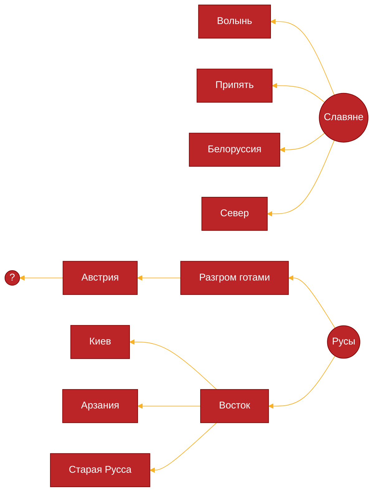
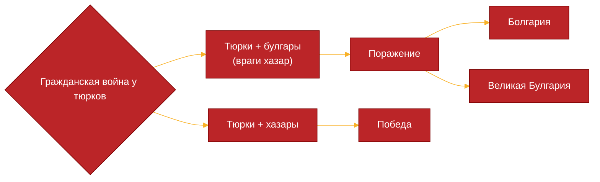
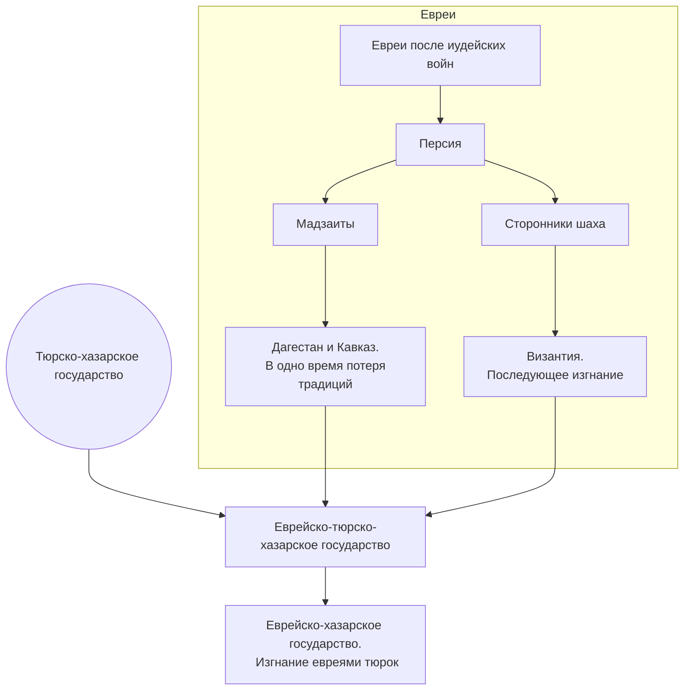
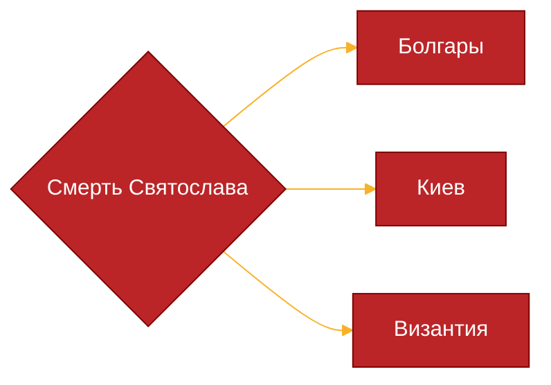
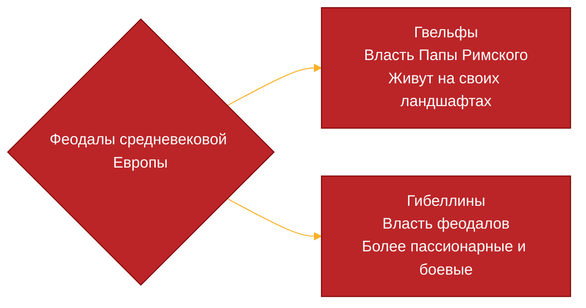
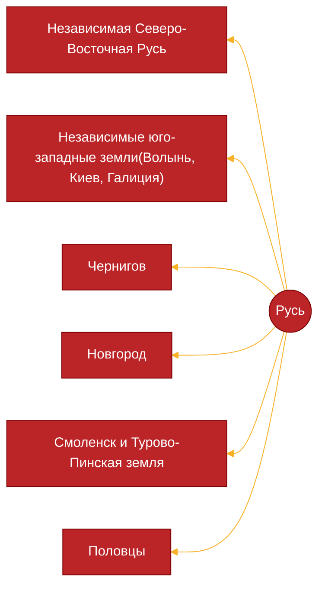

История — реальна, а современность — мнима, так как сама современность перетекает в историю, так как форма современности, когда существует привычная и стабильная система, постепенно утрачивает свой вид.

История — это постоянные изменения и перестройка кажущейся стабильности. Если рассматривать её в статике, то она будет представлять из себя фотографию конкретных социальных, экономических, территориальных и тем подобным факторов. В ином случае это движение, изменение

Историю можно представить по-разному, в том числе и в виде истории народов. В таком случае надо выделить несколько признаков(параметров):
- Пространство. Понимание места, кормящего ландшафта, в условиях которого ты существуешь 
- Время. Временная ориентация зародилась давно. Сменялись сутки, времена года, тем самым появлялись циклические системы отсчета времени. Но из-за продолжительного периода существования этносов(определение будет дальше) появилось линейное измерение времени, при котором отсчет ведется от какого-то события в прошлом. Время приобретает черты необратимости и дискретности, когда мы выделяем конкретные, сменяющие друг друга участки. 
- Все человечество — одна оболочка земли. Она состоит из этносов, которые при контакте друг с другом творят историю, являясь коллективом людей, противопоставляющий себя против других коллективов, исходя из чувства симпатии и общности Во время проживания на ландшафте образуются правила поведения — стереотипы, которые при закреплении становятся основным отличием между этносами(закрепленные стереотипы называют историческими традициями). Для описания таких традиций и используется время.

Образование нового этноса связано с неким толчком(внезапное изменение, наступающее из-за процессов во внешней среде), который будет называться пассионарным.

__Пассионарность__ — это признак, возникающий вследствие пассионарного толчка и образующий внутри популяции некое количество людей, обладающих повышенной тягой к действию.

Пассионарии стремятся изменить окружающий мир и способны на это. Они затрачивают некое количество энергии. 
Обычно люди располагают стольким количеством энергии, скольким им нужно для поддержания жизни. Если человек вбирает больше энергии, чем необходимо, то он, взаимодействуя с другими людьми, применяет её где-либо. Они вырабатывают новые стереотипы, навязывают их, управляют своими соплеменниками, создавая новый этнос и выступаю в качестве не только исполнителей, но и организаторов.

Уровень пассионарности не остается неизменным.
![[Гумилев — медиа 1.png]]
Первая фаза(пассионарный подъем) — в результате пассионарного толчка из непохожих субэтнических групп с затратами пассионарной энергии создается целостность, которая стремится к расширению, на базе старого этноса, представляющего из себя сложную систему. Это создается этнос. На базе нескольких этносов в одном регионе может появится суперэтнос(Византия). 
Вторая фаза(акматическая) — характеризуется наибольшим подъемом пассионарности. Целостности не создаются, а, наоборот, появляется стремление не подчиняться общими установлениями. Обычно влечет за собой жертвы и соперничество
Третья фаза(надлом) — пассионарный заряд сокращается, энергия рассеивается. Начинаются гражданские войны. Высший расцвет культуры — упадок пассионарности
Четвертая фаза(инерциальная) — происходит взаимное подчинение людей друг другу, образование больших государств, накопление материальных благ
Пятая фаза(обскурация) — субпассионарии(люди с пониженной пассионарностью) начинают доминировать и вытесняют пассионариев, гармоничных людей. Распад этноса становится необратимым. Господствуют вялые и эгоистичные люди.
Шестая фаза(мемориальная) — этнос сохраняет лишь исторические традиции

Этногенез — процесс, благодаря которому человечество не исчезает.

## Киевская держава
### Славяне и их соседи
Европа сама по себе разделена воздушной границей, соответствующей изотерме января. К востоку от границе температура отрицательная, а к западу — положительная. Славяне впервые появились именно на этой границе. На западе их соседями были германцы, на северо-востоке — балты
До $II$ века обстановка была стабильной, но потом из Готии(нынешняя Швеция) отправились три эскадры: остготов, визиготов и гепидов. Они вышли к чёрному морю и начали грабить Элладу, а потом разбили армию Римской империи. В итоге в Трансильвании осели гепиды, на Дунае — визиготы, а между Доном и Днестром — остготы. Ими всеми управлял царь Германих, подчинивший почти всю Восточную европу. Но в результате заговора был ранен, ослабив свою хватку. 

### Хунны и гунны
Хунны — небольшой народ, который сформировался на территории Монголии. В $III$ веке до нашей эры они ввязались в междоусобную войну в Китае («Война царств») и проиграли, отдав китайцам южные плодородные земли. С Запада и Востока их зажимали кочевники. На фоне этого произошел пассионарный толчок: хуннский царевич по имени Модэ свергнул отца в $209$, который хотел отстранить его от власти, и начал свое жестокое правление. Выстроив жесткую иерархию и систему беспрекословного повиновения, вступив затем в войну против Китая. Преимущество было на стороне китайцев, но в самом начале войны у хуннов получилось взять императора в плен. В итоге в $198$ году был заключен договор мира и родства. Но мира не настало: хунны продолжили совершать набеги и в конечном итоге проиграли. В $93$ году китайский император договорился с кочевниками запада, востока и севера выступить против хуннов и разбил их. Их правитель(шаньюй) пропал без вести, а страна развалилась. Часть ушла в Южную Сибирь, часть в расширившуюся пустыню Гоби, а кто-то в Среднюю Азию. Оттуда самые сильные двинулись на Запад, к Волге, осели на скотоводческих землях и вместе с народом Вогулов(манси) образовали новый этнос под названием гунны. Они начала войну с Готской державой. Сначала они заняли пространство между рекой Урал и рекой Дон, а потом пересекли Перекоп и окончательно уничтожили готов, ослабленных войной ещё и со славянами. 
В конечном итоге остготы покорились гуннам, а визиготы бежали в Римскую империю, где начали устраивать грабежи. У славян оказались развязаны руки.
Гораздо позже, в $453$ году умирает вождь Аттила, и держава Гуннов распадается в результате междоусобиц и внешней интервенции византийцев и сарагур(народ с востока Волги). Они бежали на Алтай и Волгу, где стали чувашами. 

### Рождение киевской державы

В результате противостояния русов-разбойников и славян побеждают русы под руководством Рюрика.
Рюрик — варяг. В $862$ году он захватывает в Новгороде власть. Восстание Вадима Храброго было разгромлено.

Рюрик умирает в $879$. После него к власти приходит малолетний Игорь под опекой Олега(«Хельги» — военный вождь в Скандинавии).

Ими предпринимается поход по пути «Из варяг в греки» и в результате:
- Захвачен Киев(Аскольд из русов и Дир из славян убиты)
- Захвачен Смоленск и другие поселения

В $IX$ веке происходит окончательно славянский раскол:
- Иллирийцы + славяне = сербы и хорваты
- Булгары + славяне = болгары

### Хазарский каганат
Хазары — кавказские племена из Дагестана.

$VII-VII$ века — арабское вторжение на Кавказ.
В  результате экспансии китайской династии Тан тюрки бегут на Запад. С согласия хазар представитель тюрков стал их ханом. Именно тюрки будут защищать неспособных и нежелающих обороняться хазар.

$IX$ век — евреи меняют тюрок на наёмников.
Они в первую очередь поднимали состояние на торговле между западом и Китаем. После крестьянского восстания и внутренних волнений в Китае торговля начинает хворать.
Это приводит к движению на север в сторону Великой перми(вырубка лесов, пушнина, рабы) и сбыт арабам.

$IX$ век — развал арабской империи. Государство Дейлем захватывает Багдад и обрубает торговлю. Евреи не могут заставить мусульманских наёмников сражаться против братьев по вере и привлекают русов, которых успешно бросают, убивая.

В результате противостояние Киева и евреев:
- Киев потерял независимость
- Случился вынужденный поход против дейлема(погибли многие)
- Смерть Игоря(во время сбора дани для хазар)

Поход Святослава на Хазарию($964-965$):
- Взятие двух основных еврейско-хазарских городов(столица и центр евреев в Дагестане)
- Изгнание евреев из части земель
- Возращение независимости Руси

### Возращение независимости Руси
После успешного похода Святослава Византия привлекает русов для решения внешних проблем.
Калокир — византийский дипломат и друг Святослава.
Святослав помогает ликвидировать независимость Болгарии. Калокир хочет воспользоваться моментом и свергнуть с помощью Киева Никифора Фоку $II$ (в прошлом хороший полководец и управляющий), который не понравился всем своими последними реформами. Но его опередили: в $969$ он был убит Цимисхием, который занял престол и разгадал замысел Калокира, сговорившись с печенегами напасть на Киев. Пока Святослав решал киевскую проблему, Византия подготовилась и совместно с болгарами в итоге разбила войско князя, заключила мир.

На острове Берзани язычники-войны убили православных воинов.

Вполне возможно, что в большинстве православный Киев подговорил печенегов напасть на слабое войско Святослава, боясь кары.

После смерти Святослава партия язычников ослабла, возобладало веяние на объединение этносов русов и славян, а Русь начала превращаться в тихую и спокойную державу, так как князь Ярополк неосознанно избежал борьбы за власть, так как его братья ликвидировались(один умер, а другой бежал).

Сводный брат Владимир был руководителем языческой партии(на самом деле ему было 15, просто окружали его соответствующие люди и группировки). В итоге столкновения двух полярных мировоззрений начинается борьба: сначала Владимир взял Новгород, потом Полоцк, Смоленск и в итоге Киев(брат вышел вести переговоры, но его подло убили). Владимир, заполучив власть, последовал общественным настроениям в столице(Киеве) и отказался от язычества. 

> [!info]
> Политические группировки в раннем Средневековье
> Часто за именами правителей(Ярополк и Владимир, Карл Лысый и Людвиг Немецкий) скрывались конкретные группировки, которые делали определенного правителя наглядным «изображением идеи»

Прегрешения Владимира:
- Убийство князя Рогволода, его семьи. Его дочь была изнасилована Владимиром
- Убийство брата
- Обман своей дружины

Военные кампании Владимира:
- Поход на Волжскую Булгарию(985). Провал
- Захват Тьмутаракани
- Корсуньская операция. С помощью предателей гарнизона из крепости кампания оказалась успешной.  Но по итогу удержаться в Крыму не удалось: Игорь отступил, взяв в жены греческую принцессу.
- Владимир отгородился о печенегов, отрезавших Русь от черного моря(будут разбиты Византией)

>[!info]
>Павликиане, богумилы, альбигойцы и так далее...
>В $IX-XII$ по всему миру начали появляться религиозные течения, которые отрицали материальный мир и признавали только духовный. Эти идеи захлестнули Европу, Византию и мусульманский мир.

В итоге все неудачи были забыты за счёт выбора веры(трудный вопрос за счёт группировок внутри страны и внешней политики). Незадолго до крещения Руси в Европе отчётливо стал виден раскол, образовавшийся за счёт формирование западноевропейского суперэтноса: западный мир начал называть «христианским» только себя, а религиозный конфликт перерос в политический. Так, Оттон $II$ предлагал на имперском сейме $983$ начать поход против «греков и сарацин». Под удар могла легко попасть Русь(польский король уже воевал с ней, а Оттон $II$ воевал с западными славянами на Эльбе).

Выбор веры
- Ислам. Не подошел из-за арабского языка, невозможности делить трапезу(русский князь делил трапезу с дружиной), запрета на вино и свинину
- Католичество. Ещё со времен Ольги, когда на папском престоле сидел Иоанн $XII$ —шестнадцатилетний юноша, который превратил Ватикан в бордель и место поклонению сатане —, русские узнали про это, и зародилась неприязнь
- Православие. В целом греки хотели дружбы с Русью и прекращения набегов + в проповедях богословы не вовлекали политику. Кроме того, в православии не было идеи предопределения, что не мешало язычникам принять эту религию

Последствия:
1. Примирение с населением Киева, разгром язычников Новгорода
2. Строительство храмов, распространение искусства и письменности

Накануне смерти, Владимир начал раздавать завоеванные Русью земли своим сыновьям, чтобы сохранить целостность державы от предательств воевод.

У Владимира было много детей, но основные:
1. Святополк. Старший сын, был нелюбим Владимиром. Накануне смерти Владимира был заточен в тюрьму с епископом, который вел с ним связи. Взаимодействовал с печенегами и поляками
2. Ярослав. Ребенок от Рогнеды. Княжил в Новгороде. 
3. Мстислав. Княжил в Тьмутаракани
4. Борис и Глеб. Любимые сыновья Владимира
В Киеве поддерживали и Святополк, и Ярослава, и Мстислава

После смерти Владимира сторонники Святополк освободили его и объявили великим князем. После этого Святополк убил Бориса и Глеба, своего брата Святослава Древлянского. Ярослав хотел бежать, но богатые и воинственные новгородцы, желающие снижения податей Киеву, встали на его сторону. В $1016$ у городка Любеч Святополк с половцами был разбит и бежал в Польшу. В Киеве началось восстановление язычества, поэтому Болеслав Храбрый(польский король) и Святополк разбили Ярослава, вошли в Киев. Новгородцы опять дали деньги, а киевляне начали „партизанскую войну“, заставив Болеслава вернуться в Польшу. В итоге Святополк опять был разбит и стал называться Окоянным.

>[!Этногенез]
>Язык и «западники»
>К моменту всех этих событий идея славянского единства уже была потрачена, но польский и русский языки оставались во многом похожими. Кроме того, здесь уже можно увидеть то, что киевляне сопротивлялись влиянию запада. Столкновение двух суперэтносов

Мстислав попытался отнять власть у Ярослава, но потерпел неудачу и заключил с ним мир, став править в мире и спокойствием Черниговом и Тьмутараканью.

Сам Ярослав не питал любви к Византии, да и его окружение тоже. Предпринятый против неё военный поход в $1043$ не имел успеха — активная внешняя политика против Византии была прекращена.

Основные партии:
- Прозападная. Изяслав Ярославич
- Национальная. Святослав Ярославич
- Провизантийская. Всеволод Ярославич

В $1036$ Ярослав разрешает печенежскую проблему, разбив их у Киева.
Византия в то же время старадет от нашествия туркменов-сельджуков, родственных печенегам.
После смерти Ярослава к власти приходит Изяслав.

В то же время появляется народ куманов, светловолосых и голубоглалых представителей на Руси стали называть половцами. Они воевали с печенегами, конфликт стал ещё сильнее на религиозной почве.
Русским с ними договориться не получилось: в $1068$ году Ярославичи проиграли битву на реке Альте, но позже Святослав Ярославич разбил их в битве на реке Синове, окончив их вторжение. После первого поражения Изяслав, находящийся в уязвимом положении, бежит в Польшу. 
Киевляне объявляют киевским князем Всеслава из Полоцка, который находился в заточение за захват и разграбление Новгорода. Изяслав с сыном Мстиславом заручились поддержкой поляков, захватили Киев в $1069$, устроили репрессии. Они прекратились только с угрозой свержения от двух других Ярославичей. Однако, польский гарнизон был изгнан по старой тактике. В $1073$ Изяслава с поддержкой двух братьев свергают, а киевским князем становится сын Ярослава Мудрого — Святослав с поддержкой Всеволода. Но в уже $1076$ он умирает, нарушая сложившееся равновесие сил. За то время частично вновь возрождается язычество, появляются волхвы, бросающие вызов церкви, но они подавляются 

По закону Ярослава Мудрого наследование шло по старшим братьям, а только потом уходило в младшие поколения.

В Руси существовал обычай изгнанников, которые в чем-то провинились:
1. Попов сын без грамоты. Ленился — изгнание из прихода
2. Купец в долгах. Нету денег по любой причине — ты виновен
3. Крестьянин без общины. Изгнали из общины — другая тебя скорее всего не примет
4. «Если князь осиротеет». Если один из братьев умирал до вступления на престол, то его сыновья автоматически лишались всех прав на неё.

Последний пункт после смерти Святослава ударил по его сыновьям, так как фактически старший брат Изяслав был жив, а Святослав был узурпатором. В Тьмутаракани начался сбор изгоев и в $1078$ они собрали войска, чтобы забрать удельные города, как Чернигов(Всеволод, а потом Владимир Мономах), обратно. В битве на Нежатиной Ниве победили старшие князья, ценой убитого Изяслава. Всеволод начал свое княжение.
Судьба братьев:
- Роман Святославич убит в половецких степях в $1079$
- Олег Святославич. Хазары после пленения его в Тьмутаракани передали его грекам. Там он был почетным пленником, пока русская гвардия не подняла бунт против Василевса. После этого он был отправлен на Родос, где женился на гречанке. В $1083$ его отряд(возможно половцы и коренные жители Тьмутаракани: ясы и касоги) подошли к Тьмутаракани, изгнали местных князей, разграбили иудеев и вокняжились. В $1094$ князь отдал город Василевсу и вернул боем себе Чернигов, выгнав Владимира Мономаха.

К $1091$ византийцы и половцы уничтожили печенегов, перебили или ассимилировали большую часть, а оставшиеся стали гагаузами.

На короткое время князь Всеволод объединил Русь, рассадив своих сыновей в удельные города. В то же время он уже не мог полагаться на Византию, потерявшую Малую Азию и оставшуюся без хозяйства. Порядок стал восстанавливаться лишь после $1081$г. В то же время Западный мир продолжал порабощение славян, так что поддержки от них ждать не стоило. 

Борьба феодалов под руководством Генриха $IV$(секта николаитов) против Григория $VII$ провалилась. Зато он в будущем будем фигурировать у протестантов и Бисмарка. 

Ситуации на Руси сложная:
- Ни Византия, ни Запад
- Два кочующих народа(торки и половцы), ненавидящие друг друга
- К грекам в церкви тяготели иерархи, а клирик опирались на Киев-Печорскую лавру
Видя сложность ситуации, Всеволод передал фактическую власть сыну Владимиру(Владимир Мономах) и скончался в $1093$.

Власть перешла Святополку $II$, который раньше был западником, но сменил вектор политики, чтобы не получить по шапке и набрал людей за достаточное жалование. Его политика не соответствовала экономическим и политическим интересам Руси. Чтобы обеспечить себя денежными средствами он пригласил евреев-ростовщиков, которые:
- Развернули свой бизнес в Киеве
- Из-за большого влияния на князя начали войну с половцами за пленниками
Война шла относительно хорошо, так как русская конница была быстрее степной.
Но не в половцах была беда, а в падение старой этики и морали.
В $1097$г. произошел съезд в Любече, а Русь фактически стала конфедерацией.
Святополк крепко взялся за власть за счёт своих людей, так что ему удавалось держать власть, несмотря на недовольство. Но в $1113$ году он умер, а в Киеве начался разгром боярских родов, евреев. Поэтому боярам пришлось послать митрополита с депутацией популярному и сильному Владимиру Мономаху.

Владимир Мономах($1113–1125$) решил за время своего правления две проблемы:
1. Остановил погромы евреев, оставил за ними их имущество, но ввёл черту оседлости, выслал тайно въехавших
2. Провел решающий похож в $1111$ году против половцев. Часть из них вошла в Русь в качестве автономии, а другая ушла в степи

Его сын, Мстилав Великий($1125-1132$) решил проблему Полоцка, выдворив местных князей в Византию. Вся Русь было объединена.

Но после его смерти на Руси случилось много проблем: она фактически распалась. В Полоцк вернулись местные князья из Византии, в Новгороде республика перестала платить подати.
С $1132-1139$ года правил сын Мстислава, Ярополк. Престол перешёл брату Вячеславу, который был свергнут в результате вторжения Чернигова, а Всеволод, сын Олега, который и управлял Черниговым, захватил власть в свои руки. В $1146$ году он умер, оставив престол брату Игорю. Тот не смог получить доверие киевлян и был свергнут Изяславом Мстиславичем. Убит киевлянами через года, когда его брат попытался освободить его.
Его смерть и в целом борьба за власть спровоцировали войну между Черниговским и Киевским княжествами. 
В то же время Ростово-Суздальская земля управлялась Юрием Долгоруким, который относился к старшей линии Мономашичей. В Киеве сидел Изяслав, представитель младшей линии. 
Долгорукий умер от отравления в $1157$ году и его место занял Андрей Юрьевич Боголюбский.

Борьба Ростово-Суздальских князей и Волынских — борьба дядей и племянников.
В результате начавшийся ещё в $1097$ году Любческий съезд через 70 лет развалил Русь.

В то же время распадался единый этнос, учитывая, что князья начали грабить завоеванные города бывшего единого государства.
Древняя Русь вступила в фазу обскурации.
Её разрывали множество этносов и субэтносов

Итоговая схема:
![[Правители Древней Руси.png]]
[[Правители Древней Руси.html|HTML-версия]]

## В союзе с ордой
Великая степь — это территория, которая простиралась с севера до сибирской тайги и с юга до горных систем и сама делилась горным Алтаем и Тянь-Шанем на две части: Восточную часть(Внутреннюю Азию с Монголией, Восточным Туркестаном) И Западную(Казахстан и вплоть до Черноморья, а когда-то включала и Венгрию). В этих двух частях несколько отличается климат, так как во Внутренней части скот может круглогодично питаться, ведь там очень маленький покров снега, а западной — нет, они заготавливали сено на зиму. Это положительно влияло на кочевой образ жизни на территориях Монголии, а вот половцы постоянно теряли независимость из-за зимы.

В целом в китайских летописях везде используется слово «татары» в отношении кочевых племён севера.
Сами татары делились на:
1) Белые. Подчинялись империи маньчжуров и охраняли их границы в зонах касания с приграничными землями
2) Черные. Жили к северу от пустыни Гоби. Ненавидели белых, подчинялись хану и пасли скот
3) Дикие. Ненавидели всех, не имели государственности
Видно, как сильно отличаются племена

Монголы жили между чёрными и дикими татарами, были небольшим народом. К $XI–XII$ веку там обитали несколько монгольских родов, параллельно ассимилировавшие аборигенов 

Рядом жили племена Кераитов(несториане, ханы) и найманы(потомки народа, изгнанного манчужарами), меркиты(воинственное племя недалеко от Иркутска), ойраты(Алтай).
Конфликты между племенами носили пограничный характер. 
В то же время начался пассионарный толчок, заключенный в людях, которые по происхождению не могли получить высокие должности, но были куда профессиональнее занимающих их.

С пассионарным подъемом манчьжуры начали проводить экспансионистскую политику, начались частые набеги на монголов в том числе. В ответ на это монгольские племена объединились и избрали первого хана, носившего имя Хабул.
В 30–40х годах $XII$ в. он остановил натиск маньчжуров, занял их территории. Но после его смерти в $1149$ племенной союз распался из-за недостаточного количества пассионариев. Маньчжурия же усилилась, начала убивать перспективных племенных вождей.

В племени кераитов в эти годы произошел капздец: законного наследника по имени Тогрул оппозиция его отца выдала Тогрула меркаитам. После освобождения отцом он попал в плен к татарам. Тогрул убежал от татар и взял власть, но оппозиция, поддерживаемая найманами и маньчжурами, заставила его бежать.
Будущее степняков казалось мрачным и разобщенным.