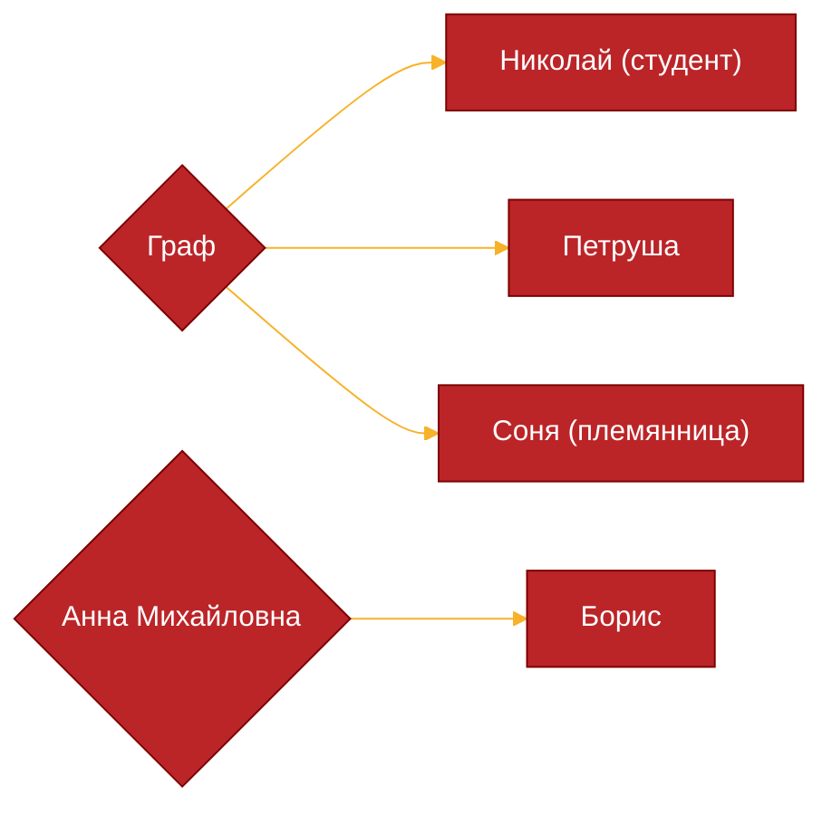
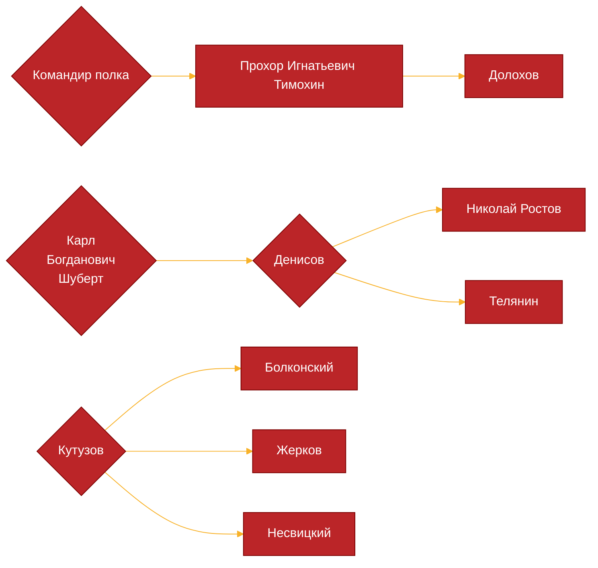
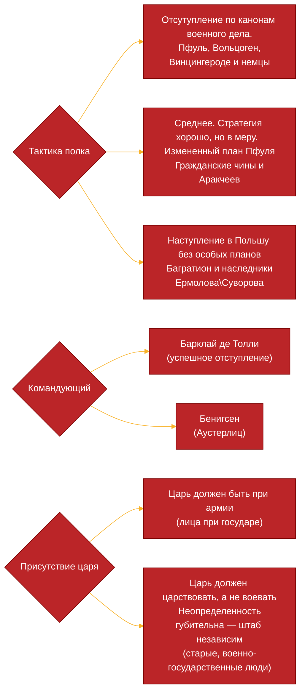

#Лето_2024 
\* Князь Василий оказывается Курагин
[[Андрей Петрович Гринев]]
## Том 1
### Часть первая
#### Глава первая
Светская беседа князя Ивана (более угрюмый и строгий) и фрейлины Анны Павловны (показной энтузиазм), во время которой вторая предлагает женить сына Князи с именем Анатоль на княжне Болконской с хорошей фамилией и приданым, живущей с отцом в деревне, чтобы не тратить на него много денег и усмирить. 
По признанию отца Анатоль — беспокойный дурак, а Ипполит — покойный.
Только дочь Элен у него была нормальная
(Мортемар и Морио эмигранты из Франции) 

#### Глава вторая
Какой-то бал Анны Павловны.
Туда прибыли разные гости и в том числе княжна Болконская (Лиза), уже будучи беременной, но держалась отлично.
Её муж ушёл на войну
На вечере был и бастард Пьер, что вёл себя неучтиво

#### Глава третья
Образовалось три кружка: вокруг аббата, вокруг Элен и вокруг Мортемар с Анной Павловной
Всё шло хорошо, только Пьер продолжал себя вести несколько бестактно
Брат Ипполит был похож на свою сестру, но на нём был налёт тупизны

#### Глава четвёртая
Вошёл Болконский, муж княгиня, и в был достаточно угрюм, скучающ. С женой отношения у него тоже не лучшие. Ему всё надоело
Болконский обрадовался Пьеру
Пьер жил с князем Василием и был ему родней

#### Глава пятая
Князь Василий по сути прагматик, но в нём заиграли светлые чувства (он сам начал благодарю её отцу) и он удовлетворил просьбу Анны Михайловны о назначении ей сына в гвардию.
Пьер опять наворотил делов, но князь Андрей его прикрыл
Пьер любит свободу и без проблем оправдывает Наполеона в своих глазах, что для других в этом обществе невозможно

#### Глава шестая
Золовка Болконской — возможная пара для Анатоля
Пьер уже три месяца в Петербурге не может выбрать карьеру (дипломат или кавалерия)
 Князь Андрей хочет убежать от этой жизни, поэтому и идёт на войну

#### Глава седьмая
Лиза очень переживает из-за отъезда Андрея

#### Глава восьмая
 У князя Василия была фамилия Курагин
 Андрей чувствовал себя скованным своей женой

#### Глава девятая
Пьер стал кутить
Долохов — семеновский офицер

#### Глава десятая
Анна Михайловна Друбецкая жила в Москве вместе со своими родственниками Ростовыми.
Выходка Пьера дошла аж до Москвы
После одной петербургской выходки Пьера выслали в Москву, Долохова разжаловали в солдаты, а Анатоль был спасен отцом
Борьба за наследство Безухова: Пьер и князь Василий
#### Глава одиннадцатая

Борис и Николай были друзьями

#### Глава двенадцатая 
Николай пошёл в армию гусаром вслед за Борисом

#### Глава тринадцатая
Соня любит Николая, а Наташа — Бориса

#### Глава четырнадцатая
Веру не любят все
Анна Михайловна готово пройти через унижения, лишь бы выбить сыну хорошую жизнь

#### Глава пятнадцатая
Натали (жена графа) вышла по словам князя Василия за «грязного медведя» (игрок, глупый, смешной)
Дядя не раз не подозвал Пьера к себе

#### Глава шестнадцатая
Пьер захотел подружится с Борисом, после признания последнего

#### Глава семнадцатая
Натали безвозмездно подарила Борису (Анне Михайловне) 500 рублей для снаряжения

#### Глава восемнадцатая
Вера, кажется, любит Берга, офицера гвардии
Марья Дмитриевна немного попустила Пьера

#### Глава девятнадцатая 
Кто-то не понимал зачем вообще вступать в какую-то войну, а кто-то был этому вступлению рад и воодушевлен

#### Глава двадцатая
Соня плакала потому что:
- Ревность к Жюли
- Страх отправления Николая на войну
- Близкая кровная связь её и Николая, а значит соответствующая реакция родственников

#### Глава двадцатая первая
Князь строит козни против Пьера, чтобы завещание и просьба об усыновлении не попали к императору
Местные княжны ополчились ещё и против Анны Михайловны

#### Глава двадцатая вторая
Пьера в основном проталкивала Анна Михайловна (свои интересы?)

#### Глава двадцать четвёртая
Безухов умер

#### Глава двадцать пятая 
Семейство Болконских имеет старшее поколение в лице Николая Андреевича Болконского. Он достаточно строгий мужик, в какой-то степени по характеру пруссак и любит дисциплину, который предъявляет к окружающим много требований и которого многие боятся, несмотря на то что он по сути и не находится в какой-то должности. В бога особо не верит. Там он живет со своей дочерью, Мариной, которую воспитывает со всей серьезностью. 
Его дочь скорее представляет противоположность отца: она религиозна и не столь порядочна, не может усвоить геометрию.
Она общается со своей подругой Жюли, которая и сообщила ей о смерти Безухова и планах выдать Марину замуж (к этой новости она отнеслась с христианским смирением)
Кроме того, она знала Пьера в детстве

Кажется, князь Василий потерпел неудачу и сконфуженный умчал в Петербург.

Все очень насторожены тем, что начинается война. У многих на войну ушли родственники

#### Глава двадцать шестая
Болконских приняли круто
Андрей любил отца

#### Глава двадцать седьмая
Отец, хотя и сидел в деревни, знал не хуже сына расстановку сил в Европе. Правда он все равно недооценивал Наполеона

#### Глава двадцать восьмая
Андрея тоже был не особо религиозен
Сестра навестила его перед отъездом и подарила образ
Отец был горд фактом того, что сын идет на войну 

Николай Болконский написал Кутузову, чтобы тот долго не держал Андрея в качестве адъютанта

Также он сказал, что будет опечален фактом его смерти, но будет в то же время стыдится трусости.

Андрей попросил отца в случае смерти забрать сына к себе

### Часть вторая

#### Глава первая
В октябре 1805 русские войска начали развертываться в Австрии
Один из таких полков должен был пройти смотр лично Кутузовым и офицеры нарядили всех солдат. В целом все было хорошо, кроме сапог. Только вот прикол был в том, что наоборот Кутузову нужен был такой себе по состоянию полк (стратегические соображения и планирование операций с австрийским штабом), так что за час начали всех переодевать обратною.
В то же время клоун-Долохов надел синюю шинель, но  постоял за себя перед полковым генералом.
Полковой командир был тоже вроде нормальный, но со слабостью к женскому полу и общественному быту.

#### Глава вторая
По приезде Кутузова полк показал себя отлично. Командир довёл полк почти в идеальном состоянии, не считая ботинок.
Командир полка вполне себе с радостью встретил Кутузова и ревностно выполнял роль подчиненного
В составе свиты Кутузова был и Болконский со своим товарищем Несвицким

Гусарский корнет Жерков — бывший член компании Долохова

#### Глава третья
Основная проблема в сношениях Австрии и России — присоединение русского корпуса к армии эрцгерцога
Болконский за пределами России почувствовал себя счастливым: ему больше не надо притворятся и играть роль — он просто занимается приятным делом
В армии он показал себя хорошо и его оценили (в том числе и Кутузов)
Союзная австрийская армия была разбита. Теперь Болконский начал беспокоится за судьбу русской. Кто-то не понимал серьезность ситуации

#### Глава четвертая
Николай Ростов был в хорошем расположении духа в Павлоградском полку в гусарском эскадроне, когда в штабе все уже летело после проигрыша австрийцев
Лаврушка — лакей-вор пи Денисове
Поручика Телянина многие не любили, в том числе был и Ростов
Вот он например украл кошелёк у Денисова

#### Глава пятая
В ответ на разоблачение Ростовым Телянина, офицеры его полка прессанули его, так как они боялись за честь полка
Но извинятся тот отказался

#### Глава  шестая 
Русские начали отступать к Вене, уничтожая мосты
На мосту произошла заминка и Несвицкий поехал разруливать ситуацию

#### Глава седьмая 
Несвицкий особо ничего не сделал
Со снабжением  у гусаров было лучше, чем у пехотинцев 

#### Глава восьмая
Эскадров Денисова перешёл мост, попав под обстрел французов, но не понеся потерь личного состава
Ростов был рад первому опыту
Полковнику неожиданно доложили, что мост не подожгли и он отправил разбираться с этим делом Денисова
Ростов не очень хорошего себя показал, но от юнкера никто и не ожидал особых результатов.
Задача выполнена, а из потерь два раненых и один убитый

#### Глава девятая

>[!quote] Обстановка на фронте
>Преследуемая стотысячною французскою армией под начальством Бонапарта,
встречаемая враждебно-расположенными жителями, не доверяя более своим союзникам,
испытывая недостаток продовольствия и принужденная действовать вне всех предвидимых
условий войны, русская тридцатипятитысячная армия, под начальством Кутузова, поспешно
отступала вниз по Дунаю, останавливаясь там, где она бывала настигнута неприятелем, и
отбиваясь ариергардными делами, лишь насколько это было нужно для того, чтоб отступать, не
теряя тяжестей.

Единственная задача — соединится с войсками из России
Несмотря на потери и отступление, Кутузов смог дать на левом берегу Дуная врагу отпор и разбил дивизию неприятеля
Андрей Болконский был только слегка ранен, поэтому Кутузов послал его донести известии о победе австрийскому двору. Это был важный шаг к повышению и начало новой жизни Андрея
Чет в Вене его приняли не очень и послали к равнодушному военному министру

#### Глава десятая
Билибин,  русский дипломат и друг Андрея, сказал, что ничего хорошего ждать не надо. Австрийцы планируют переметнутся, а кампания провалилась 

#### Глава двенадцатая
Билибин оказался неправ и русского посланника встетили хорошо. Даже медальку выписали
Только вот Наполеон прошёл через мост Вены и движется к императору, что ставит под удар русскую армию — Болконский отчаливает

#### Глава тринадцатая
Русская армия беспорядочно отсутпала.
Багратиона отправили со своим отрядом на смерть

#### Глава четырнадцатая
Кутузов для отступления послал генерала Багратиона с его четырехтысячным отрядом на смерть. Но они, вымотавшиеся, гораздо раньше встретили превосходящую армию французов
Надеясь разбить «армию Кутузова» (он не знал про отступление и про то, что это всего один отряд) без боя, генерал Мюрат пошёл на хитрость и предложил перемирие. 
Когда Наполеон увидел это сообщение, то он раскусил обман, но русские уже несколько восстановились

#### Глава пятнадцатая
Болконский присоединился к Багратиону
Там же в качестве солдата был Долохов

#### Глава семнадцатая
Французы начали атаку
Жерков тоже оказался с Багратионом
Багратион давал подчиненным действовать самим
Французы постепенно жали русских

#### Глава восемнадцатая
В лощине шла ожесточенная битва. Багратион подвёл дополнительные батальоны

#### Глава девятнадцатая
Атака егерского полка обеспечила отступление правого фланга
Батарея Тушина подожгла деревню и обеспечила отступление центра
Только левый фланг в том числе с Павлоградским гусарским полком был расстроен. Багратион послал Жеркова с приказом о немедленном отступлении
Жерков не передал указания, так как не решился ехать на линию боевого соприкосновения. 
Гусарский и пехотный полк не могли скоординироваться 
Начальники без решимости все руинили
Началась атака эскодрона, во время который Николай был ранен, а его конь убит. За ним гнались французы, стреляли, но он добежал до кустов к лесным русским стрелкам

#### Глава двадцатая
Полки не слушались командира. Битва на левом фланге, казалось бы, проиграна, но неожиданная атака рота Тимохина, в которой был и Долохов, на французов, обратила тех в бегство

Батарея Тушина, хотя она и стояла без прикрытия, не была взята французами: по частоте её огня они не предполагали, что она ничем не защищена. Батарея действовала очень эффективно под командованием Тушина, хотя и понесла потери(два орудия из четырёх). Князь Андрей передал приказ об отступлении и помог отвести артиллерию.

#### Глава двадцать первая
Тушин подобрал раненого Ростова
У деревни Гунтерсдорф французы ещё раз потерпели поражение
Наступило затишье. Собрались начальники: Багратион, Андрей, Жерков, командующие. Взято было французское знамя и полковник. На встречи перед Багратионом упомянули Долохова
Багратион задал Тушину вопрос про прикрытие, на которое он не мог ответить, не подставив другого начальника. Поэтому он молчал, пока за него не начал говорить Болконский

Ростов пожалел, что пошёл в армию.
Отряд Багратиона соединился с армией Кутузова  

### Часть третья
#### Глава первая
Василий начал думать о том, чтобы женить свою дочь на Пьере
Все изменили отношение к Пьеру, а он до сих пор не очень понимал обстановку вокруг
Василий начал помогать и очень сильно влиять на Пьера (назначил его на должность в министерстве внешних дел)
 Анатоль тоже ушёл в армию, так что окружение Пьера полностью формировалось князем.
 Анна Павловна начала тоже сводить Пьера и Элен
 Элен начала кампанию по покорению Пьера
 Пьер начал что-то подозревать

#### Глава вторая
Василий решил с Анатолем посетить Николая Болконского
С пинком Василия Элен и Пьер поженились

#### Третья глава
Болконский не оказался рад приезду Василия
Маленькая княгиня все время боялась Николая Болконского и испытывала к нему антипатию
Анатоль видел в невесте только кошелёк. Его гораздо больше привлекала её служанка.
Анатоль понравился Мари.
Отец ещё задавался вопросом, готов ли он отпустить дочь
Вообщем Анатоль служит чисто формально
Гувернантка имела планы на Анатоля

#### Пятая глава
Николай Болконский очень сильно любил свою дочь
Мария не покинула своего отца

#### Глава шестая
От Николая домой пришло письмо. Все очень обрадовались.
Он был произведён в офицеры
Родственники отправили передачку через Бориса

#### Глава седьмая
К 12-ому ноябрю гвардия только подошла к кутузовской армии
Борис завёл связи с Болконским через Пьера.
Берг был тоже с Борисом
Борис с радостью пробивался по карьерной лестницы, а Ростов не хотел пользоваться рекомендательными письмами
Болконский и Ростов взаимно не любили друг друга

#### Глава восьмая-девятая
Ростов — верный императору солдат
Борис — карьерист а-ля князь Василий
Принято решение атаковать Наполеона в Аустерлице

#### Глава десятая
Ростова и его эскадрон оставили сначала в резерве, но потом подвели
Император Александр сам ринулся в авангард
Ростов откровенно был слепо влюблен в Александра и в русскую армию

#### Глава одиннадцатая
Во время Аустерлицкого сражения Андрей все время был при главнокомандующем
Кутузов предвидел Аустерлицкое поражение

#### Глава двенадцатая 
Видимо план Вейротера был одобрен скорее государем, нежели чем военным советом.
Болконский ищет славы

#### Глава тринадцатая
Ростов предложил Багратиону съездить(Ростов) с гусарами и проверить холм с вражескими войсками. Проверили. А ещё он попросился в сражение, на что Багратион назначил его своим ординарцем

#### Глава четырнадцатая
В войсках началась неразбериха: приказы путались.
Упал боевой дух, так как местные военачальники были несогласны с планом.
В тумане завязался первый бой.
Наполеон в то же время стоял уже вблизи русских войск со всей своей армией, пока ещё не замеченный

#### Глава пятнадцатая 
Князь Андрей раньше времени почувствовал победу и потерял трезвость мышления
Кутузов начал предпринимать постепенно свои действия, которые были обращены вспять вмешательство императора Александра

#### Глава шестнадцатая
Французы появились неожиданно из-за чего началась паника и закономерный конец
Болконский смог взять контроль над одним из расстроенных батальонов, перехватив знамя, но был ранен

#### Глава семнадцатая
Багратион отправил Ростова, чтобы уточнить приказания у Кутузова или Александра
Ростов скакал, а тем временем:
- Лейб-уланы расстроенные возвращались из атаки
- Кавалергарды понесли огромные потери
- Гвардейские полки случайно столкнулись с французами, а Берг ранен
- Австрийские и русские полки сражались друг с другом
- На Праценской горе были французы

#### Глава восемнадцатая
Ростов не мог поверить, что Александр был ранен с Кутузовым.
Ростов нашёл Александра, но не в лучшей кондиции, но не решился к нему подъезжать
В пятом часу сражение было проиграно уже везде, более 100 орудий было захвачено
Долохов уже в качестве офицера выжил в этом сражении

#### Глава девятнадцатая 
Болконский так и остался на этом холме
Когда он пришёл в себя, то к нему подъезжал Наполеон со свитой
Когда Наполеон остановился над ним, то подумал, что он мертв.
В итоге Наполеон распорядился отправить Болконского в госпиталь ко всем пленным.
Там был князь Репнин, глава кавалергардского полка.
В такой трудный момент он вспомнил о семье, а Наполеона, бывшего своего героя, посчитал ничтожным 

## Том 2
### Часть первая
#### Глава первая
Николай Ростов (с Денисовым) вернулся домой, так как его отпустили в отпуск. Там все встретили его с любовью, только отношения с Соней держались теперь в секрете лучше

#### Глава вторая
Борис начал работать при штабе.
В Москве местные круга обвинили иностранцев и Кутузова в поражение под Аустерлицем
Отец Николая в качестве представителя московского клуба готовился принимать у себя Багратиона
У Пьера несчастный брак

#### Глава третья
Долохов познакомился с Ростовым 

#### Глава четвертая
Жена Пьера изменяла ему с Долоховым 
Долохов вёл себя как мудак (лучше на фронте ему и оставаться)
Пьер вызвал Долохова на дуэль за весь этот кабздец

#### Глава пятая
 Пьер одержал победу на дуэли, а Долохов оказался ранен
 Долохов (для них нежный) жил в Москве со старой матерью и сестрой

#### Глава шестая
Элен вела себя как мразь.
Элен просто максимально не любила Пьера
Пьер чуть не убил Элен, а потом уехал один в Петербург

#### Глава седьмая
Николай Болконский получил от Кутузова письмо, где тот выставил Андрея в хорошем свете и заверил отца, что тот жив. 
У отца все равно случился приступ гнева, но маленькая княжна его поддержала. 
Отец стал постепенно ослабевать

#### Глава восьмая
У маленькой княжны начались роды.
Князь Андрей вернулся домой

#### Глава девятая
Маленькая княжна умерла во время родов

#### Глава десятая
Участие Ростова в дуэли Долохова и Безухова было замято и он был определен адъютантом к генерал-губернатору Москвы
Ростов за время восстановления Долохова сдружился с ним ещё сильнее
Долохов начал сближаться с Соней

#### Глава одиннадцатая
Соня отшила Долохова

#### Глава двенадцатая
Денисов полюбил Наташу

#### Глава тринадцатая
Долохов готовился уезжать на фронт.

#### Глава четырнадцатая 
Ростов проиграл Долохову 43 тысячи рублей (месть за Соню?)

#### Глава шестнадцатая
Денисова тоже отшили и он поехал в армию
За ним Ростов

### Часть вторая
#### Глава первая
Пьер нравственно страдал все время после дуэли.
Во время остановки на одной из станций он встретил одного на вид умного старика, с которым он захотел поговорить

#### Глава вторая
Старик оказался масоном, и он слышал о Пьере
Старик раскритиковал Пьера за его образ жизни, и тому стало грустно. Он попросил помощи у старика, а тот посоветовал обратиться ему к графу Вилларскому и на некоторое время уйти в уединение. 
Стариком оказался известный масон Осип Алексеевич Баздеев.

#### Глава третья
Он провёл в уединение примерно неделю, пока к нему не прибыл Вилларский. Он предложил вступить в орден, а Пьер согласился.
Его привели в комнату, где брат ордена рассказала о его целях и добродетелях. Было несколько странных обрядов

#### Глава четвертая
Пьера приняли в ложу

#### Глава пятая
Князь Василий приехал к Пьеру, чтобы уладить ситуацию с Элен. 
Пьер оказался на развилке, где один путь ведёт его к новой жизни и возрождению, а другой — к старой. В итоге он выгнал Василия и уехал на юг, где братство дало ему контакты киевской и одесской ложи

#### Глава шестая 
У Пьера могли быть очень большие проблемы из-за дуэли, ведь информация о ней дошла до императора, но дело замяли.
Пьера посчитали при дворе сумасшедшим
К тому времени началась вторая война Наполеона и русского императора в границах Пруссии. Прусская армия оказалась разгромлена
Борис присутствовал на вечере у Анны Павловны. За все это время он успел поставить себя в хорошее положение и стал адъютантом какого-то важного лица
Все свои деньги Борис выделял на светское общество: так с поддержкой влиятельных людей он и продвигался по службе. Наташу он больше не любил, как и Москву. Заводил знакомства только с влиятельными людьми.
Элен начала играться с Борисом

#### Глава седьмая
Ну всё, Элен шлюха

#### Глава восьмая
Князь Николай стал отвечать по поручению императора за сбор ополчения.
Андрей уехал в имение  Богучарова, выделенное ему отцом. Он решил навсегда уйти от военной службы
Княжна Марья, нянька Савишная, гувернантка стала ухаживать за маленьким Николаем
Отец хотел, чтобы Андрей снова вернулся в армию

#### Глава девятая
Ребенку было не очень хорошо, но в итоге он выздоровел 
Обстановка в русской армии была достаточно неоднозначной: с одной стороны была одержана одна победа над Наполеон, с другой стороны началась атака на местное население и конфликты между командующими. 

#### Глава десятая
Пьер приехал в Киев, где снова загулял.
Его обманул главноуправляющий, поэтому его реформы имений не имели толка

#### Глава двенадцатая 
После свидания с Пьером у Болконского во внутреннем мире началась новая жизнь.
Он сожалел о смерти жены

#### Глава тринадцатая 
Пьер впервые повстречался с княжной Марией после стольких лет разлуки

#### Глава четырнадцатая 
Все были только хорошего мнения о Пьере: отец, княжна Мария, даже маленький Николай и гувернантка

#### Глава пятнадцатая 
Ростов, возвратясь в полк, понял, что это место для него стало вторым домом.
Он испытывал здесь такое же спокойствие, как и под крышей родительского дома. Но здесь было все понятно: не было света, не было интриг, а только свой полк и другие вещи, до коих не было дело

Ростов до сих пор чувствовал себя виноватым, поэтому от родителей принимал только две тысячи рублей, а не десять, и хотел выслужиться.

Только вот павлоградский полк опоздал и не принял участие в основных сражениях кампании. Он был присоединен к отдельному корпусу. И вот вышло так, что полк остановился в одной разоренной деревне на некоторое время. Солдата и офицеры с конями перебивались без еды.\

За это время Денисов и Ростов сдружились ещё сильнее

Ростов помог польской семье

#### Глава шестнадцатая
Денисов забрал силой еду у пехотной части (грабить караван)
Оказалось, что полк морит голодом и кладёт в себе в карман Телянин.
Денисова захотели снять с поста, но он получил легкое ранение и с радостью попал в госпиталь

#### Глава семнадцатая
Павлоградцы опять пропустили важное сражение. Ростову в целом было грустно без друга.

#### Глава восемнадцатая
В госпитале Ростов встретил Тушина без руки. Он, оказывается, жил с Денисовым.
К сожалению, все-таки Денисову пришлось написать прошении о помиловании императору, хотя ему и было очень плохо от этого

#### Глава девятнадцатая
Борис Друбецкой был назначен императору в состав свиты во время тильзитской встречи
Борис вошёл в высший свет и его знал сам император
У Бориса был адъютант Жилинский
Борис был не особо рад видеть Ростова, но ввёл его в свое общество.
Ростов попросил передать ходатайство императору, но Борис предложил действовать через другие каналы

Ростов, как солдат, и Борис, как военный карьерист, по-разному относились к перемирию с французами.

#### Глава двадцатая
Ростов все-таки передал письмо императору через кавалерийского генерала

#### Глава двадцать первая
Ростов продолжал быть верным государю, хотя армия и была настроена против мира

### Часть третья
#### Глава первая
Князь Андрей два года безвылазно провёл у себя в деревни.
Он смог воплотить в реальность все мечты Пьера у себя.
Часть крестьян перешла в разряд вольных хлебопашцев 

Андрей встретил по дороге дуб. Он был старый и не ждал весны и всю любовь. Андрей согласился с дубом

#### Глава вторая
Князь Андрей поехал к Илье Ростову по каким-то там делам с опекунством.
Ему не особо понравился этот глупый старик, который задержал его, но Наташа со своей жизнерадостностью возбуждала в нём молодые чувства

#### Глава третья
Андрей поехал когда-то ещё и начал искать дуб. Он нашёл его красивым, большим и понял, что жизнь его ещё не кончена, что он докажет этой девочки (Наташе), что она должна знать о его существовании. Он снова захотел славы

Он собрался в Петербург, так как не мог больше сидеть в деревни и растрачивать себя

#### Глава четвертая
В августе 1809 года он прибыл в Петербург.
В то время в России гремели государственные преобразования Сперанского и Аракчеева.
И вот Андрей попытался вернуться на службу. Император его не особо любил после ухода в 1805, поэтому пришлось действовать через Аракчеева. И его там встретили, кажись, тоже не особо радостно, но зачислили (на самом деле нет, там надо было подождать ещё одобрения) в комитет о воинском уставе без жалованья.

#### Глава пятая
У Андрея было хорошее положение в Петербургском обществе:
- Просвещенные либеральные круги поддерживали его из-за реформ и начитанности 
- Консерваторы и старики сочувствовали ему
- Женское общество видело в нём холостяка с интересной историей

На одном из вечеров он встретил Сперанского. Сперанский слышал про него. Сперанский предложил свести князя Андрея с Магницким, директором комиссии военных уставов.

Симпатия Сперанского была обусловлена:
- Вольными хлебопашцами 
- Андрей не обиделся на приказ о придворных чинах

#### Глава шестая
Сперанский сделал сильное впечатление на Андрея: он нашёл в нём какой-то идеал, какой видел когда-то в Бонапарте.
Андрей нашёл удивительную веру в силу и законность ума.
Сперанского назначил  его начальником комиссии составления вагонов

#### Глава седьмая
Пьер стал главой масонской ложи в Петербурге и начал содержать её.
Тем не менее, смотря на действия свои братьев, его вера потихоньку рушилась. Чтобы это исправить он отправился заграницу для изучения масонства, где он преуспел
Дал свою речь, где призвал распространять их учение, но она была встречена негативно
\
#### Глава восьмая
Осип Алексеевич дал Пьеру тетрадь, для того чтобы записывать мысли. Он призвал его не распространять учение, а совершенствовать себя.
Пьер простил жену

#### Глава девятая
За время разлуки Элен успела получить отличную репутацию в светских кругах.
Вот Безухов теперь тоже попал туда. Но ничего интересного: жена красавица и чудак-муж
Только Борис его раздрожал

#### Глава десятая
Пьер по совету Осипа Алексеевича поступил на работу в комитет.
Борис был принят в масонство
В его душе начали наклевываться кардинальные изменения

#### Глава одиннадцатая
У Ростовых денежные дела не поправились, поэтому отец поехал на службу в Петербург
Берг сделал предложение Вере и она согласилась
В петербургском доме у Ростовых были Берг, Пьер и Борис
Берг пришёл и требовал деньги

#### Глава двенадцатая
Хотя Борис и хотел полностью порвать с Наташей, но у него не получалось это сделать. Он стал чаще посещать Ростовых и редко приезжать к Элен

#### Глава тринадцатая
(скорее всего, Наташа узнала, что Пьер масон от Бориса. Не очень-то он и верен обществу)
Графиня, понимая, что Борис ставит себя и её дочь под удар, поговорил с ним и он перестал посещать Ростовых

#### Глава четырнадцатая
Наташа ехала на свой первый в жизни бал (1810)
Ехали они вместе с родственницей, фрейлиной старого двора, Перонской 

#### Глава пятнадцатая 
На балу были:
- Анатоль
- Элен
- Пьер
- Болконский 

#### Глава семнадцатая 
В Наташе князь Андрей нашёл что-то прекрасное, что-то без отпечатка света
Андрей пригласил её на танец по просьбе Пьера, а после этого к ней подошло много кавалеров, хотя до этого она никому не была нужна
Танцевала она прекрасно

#### Глава восемнадцатая 
У Андрея, видимо, снова перевернулась жизнь. Ему стали не столь интересны преобразования

#### Глава девятнадцатая 
Князь Андрей возобновил общение с Ростовыми, переменил к ним отношения. С Наташей он чувствовал себя счастливо.
Он решил оставить службу, заняться воспитанием сына и уехать заграницу.

#### Глава двадцать первая
Андрей захотел женится на Наташе.
Он раскрывал свои чувства только Пьеру, а тот выслушивал его, хотя и ему было грустно от своей печальной судьбы 

#### Глава двадцать третья 
Родители Наташи согласились, Наташа тоже согласилась, но Николай Болконский потребовал отложить свадьбу на год
Помолвка с Наташей осталась тайной, так что Болконский дал право Наташе в течение этого года понять, любит ли она его

#### Глава двадцать пятая 
Николай Болконский за все это время сделался ещё слабее (в плане здоровья). Это коснулось и Андрея

#### Глава двадцать шестая
Николай Болконский очень сильно бесился из-за того, что невеста сына не богатая и не знатная

### Четвёртая часть
#### Глава первая
Николай Ростов стал командовать эскадроном вместо Денисова
Ему пришлось взять отпуск и на некоторое время вернуться к своим, так как хозяйство у них не шло. Он не хотел возвращаться, так как на службе жизнь была размеренной и спокойной

#### Глава вторая 
Ростов поступил по чести и не стал припоминать Борису и Анне Михайловне их долги

#### Глава шестая 
Ростов познакомился с Илагиным 

#### Глава седьмая
(момент с танцем с дядюшкой и балалайкой)
Может Наташу и воспитывали на французский манер, но она русская

#### Глава восьмая
Ростов вышел из числа предводителей, но доходы не поправились
Мать хотела, чтобы Николай вышел за Жюли Карагину, богатую невесту
Андрей задерживался из-за раны

#### Глава двенадцатая 
Николай все-таки с Соней

#### Глава тринадцатая 
В доме случился скандал, матери стало плохо, а Николай уехал в полк 

### Часть пятая
#### Глава первая 
Пьер после помолвки Наташи и Болконского и после смерти его духовного наставника-масона разочаровался в мире (он везде видел ложь и несправедливость), вступил в холостяцкие клубы, дабы не порочить жену уехал в Москву, начал пить и понял, что стал тем самым старым московским барином.
Он читал, кутил и спал
Здоровье из-за вина ослабло

#### Глава вторая 
Отец Болконского стал потихоньку сходить с ума, когда переехал в Москву: он так хотел ущипнуть сына, что стал слишком нежен с гувернанткой и поставил её выше княжны Марьи.
У той к тому моменту совсем пропали все радости жизни: гувернантка перестала быть её подругой, а с Жюли они все-таки не сошлись

Еще Николай Болконский не подпускал женихов к дочери 

#### Глава четвертая
Княжна Мария решила любой ценой сдружить невестку и отца 

#### Глава пятая 
Борис не смог найти богатую партию в Петербурге и прибыл в Москву. 
Там он разрывался между Болконской и Жюли.
Болконская привлекала его больше, но она не отвечала на его ухаживания
В конце-концов он, чувствуя отвращение, вышел за Жюли 

#### Глава шестая 
Ростовы, кроме матери, приехали обратно в Москву, чтобы уладить дела, собрать приданое и остановились у Марьи Дмитриевны, ведь их дом был не растоплен 
Та предложила Наташе свести её с княжной Марией 

#### Глава седьмая 
Наташу очень плохо приняли в доме Ростовых.
Княжна Мари не полюбила невесту брата из-за зависти к любви брата и её молодости.
Она плакала в своей комнате 

#### Глава восьмая 
Долохов за это время был на Кавказе и в Персии 

#### Глава десятая
Анатоль убил любовь Наташи к Андрею

#### Глава одиннадцатая 
В какой-то степени Анатоль Курагин был животным, который не думает о своих поступкахи их последствиях  и просто любит проводить время, веселясь и забавляясь с жещинами.

Долохов же просто играл с ним, пользуясь его средствами и положениями, упиваясь своей властью над ним

#### Двенадцатая глава
Элен начала дружиться с Наташей. Она захотела свести её и брата

#### Пятнадцатая глава 
Наташа совершила главную свою ошибку и отказала Болконскому
В то же время она возненавидела Соню, так как она не разделила её любви к Анатолю

#### Шестнадцатая глава 
Долохов и Анатоль готовили план похищения Ростовой 
Анатоль должен был вывезти её за 60 верст от Москвы и обвенчать, а потом они бы отправились заграницу 

>[!quote] Про Анатоля
>И Анатоль с тем особенным пристрастием (которое бывает у людей тупых) к
умозаключению, до которого они дойдут своим умом, повторил то рассуждение, которое он раз сто повторял Долохов

#### Глава семнадцатая 
Соня схватила за жопу Анатоля и Долохова 
Дворник начал бороться с Долоховым 

#### Восемнадцатая глава 
Засаду устроила Марья Дмитриевна.
Она разочаровалась в Наташе и обещала добраться до Курагина 

#### Девятнадцатая глава
Пьер прибыл к Марье Дмитриевне и узнал правду, а также раскрыл секрет Анатоля про женитьбу 

Мария Дмитриевна попросила Пьера навестить Анатоля и передать ему послание 

>[!quote] Пьер о Наташе
>Милое впечатление Наташи, которую он знал с детства, не могло соединиться
>его душе с новым представлением о ее низости, глупости и жестокости. Он
>вспомнил о своей жене. «Все они одни и те же», сказал он сам себе, думая, что
>не ему одному достался печальный удел быть связанным с гадкой женщиной.

#### Двадцатая глава 
Пьер разъебал Анатоля, да так, что тот уехал на следующий день из Москвы в Петербург 

У Пьера гнев, как у отца 

>[!quote]
>– О, подлая, бессердечная порода! – проговорил он и вышел из комнаты.

#### Двадцать первая глава 
Наташа отравилась мышьяком, но в последнюю минуту передумала и её откачали 
Пьер начал чинить репутацию Наташи
Николай Болконский был рад и устроил все так, чтобы по приезде Андрей узнал про все события 

Пьер был приглашен Андреем на разговор.
Княжна Мария (чисто по моему мнению) предала свою веру, обрадовавшись расставанию Наташи и брата. 
Андрей все ожидал и принял на вид новость достойно 
Но оставшись наедине с Пьером, он сказал все 
Пьер уехал из дома, где все ненавидели Ростовых 
Андрей попросил Пьера передать Наташе её письма и портрет 

#### Двадцать вторая глава 
Он передал все необходимые письма, отчитался пред Марией Дмитриевной, признался Наташе в симпатии и помчал домой в мороз, видя комета 1812 года и чувствуя себя счастливым 

## Том 3
### Первая часть 
#### Глава первая 

С конца 1811 года войска обеих держав стягивались к границам
12 июня 1812 началась война.
Во время войны совершается много преступлений, но на них совсем не считают таковыми

>[!quote] Фатализм и история
>Фатализм в истории неизбежен для объяснения неразумных явления (то есть тех, разумность которых мы не понимаем)

#### Глава вторая
Все французские войска ликовали и радовались началу похода
Французы начали забрасывать фальшивые русские ассигнации 

#### Глава третья
В русской армии были проблемы: войска не были готовы и не была согласована общая стратегия, так как отсутствовал главнокомандующий, а император на себя эту роль не брал
Когда Наполеон дал приказ об атаке, Александр Павлович находился на балу. Там присутствовали Элен и Борис, который стал самодостаточном человеком и не искал покровителей
Александру известие сообщил Балашев, а их разговор подслушал Борис.
Александр попытался остановить войну и написал письмо Наполеону.

#### Глава четвёртая
Балашев начал своё путешествие к Наполеону с письмом:
1) Его встретили какие-то не очень проявляющие почтения кавалеристы
2) Потом сонный полковник
3) Наконец Мюрат, который стал неаполитанским королём и который старался сохранить хорошие отношения с посланником

#### Глава пятая
Следующим его встретил маршал Даву. 
Тот обращался с русским генерал-адъютант очень грубо

Наполеон и французы уже чувствовали себя победителями и приняли посланника в том же доме, откуда Александр посылал тогда Балышева (прошла приблизительно неделя) 

#### Глава шестая
С точки зрения Наполеона Россия готовилась к войне с Францией.
Теперь он не согласен отступить за Неман, ведь он сам *Наполеон*, а не какой-нибудь герцог Баденский
Наполеон начал в  какой-то степени оскорблять царя и его окружение, припоминая желание Александра быть полководцем
Он обещал, что за предательство Россия будет откинута за Днепр
Наполеон передал письмо Александру

#### Глава седьмая
Наполеон пригласил русского посланника отобедать у него.
Настроение у него заметно улучшилось после конной прогулки
Во время обеда Балашев в ответ на оскорбление в отсталости России тонко напомнил Наполеону про Испанию, где он потерпел поражение, и Карла XII.
В конце концов Балашев уехал и война началась 

#### Глава восьмая
Князь Андрей после встречи с Пьером поехал в Петербург, чтобы повидаться с Анатолем, но его уже не было: он уехал в Молдавскую армию. Андрей же встретил Кутузова и попросил назначение, попав в свиту генерала, ехавшего командовать молдавским фронтом. Он пытался догнать его, чтобы вызвать на дуэль. Но тот опять убежал и он решил, что когда-нибудь все-таки достанет его. 
Он искал в армии способ уйти от пережитого им горя и занимался делами.
В 1812 до места дислокации русских в Турции дошли новости о войне с Наполеоном и Андрей попросил у Кутузова назначение в Западную армию. Тот согласился, так как своим трудолюбием Андрей смущал его, и направил к Барклаю де Толли

Князь Андрей заехал к отцу по дороге. Тот выжил из ума и настроился против своей дочери, заменив её на француженку. Дом по сути разделился на две части. Андрей уехал оттуда через несколько дня, разругавшись с отцом, не способным изменить себя, защитив Машу, не найдя прежней нежности к сыну.

#### Глава девятая
Барклай де Толли принял Болконского сухо.
Тот начал погружаться с головой в военные дела и вывел для себя, что важны не столько планы, сколько способность быстро отвечать на меняющиеся обстоятельства
Обстановка на фронте была такова, что три русские армии отступали и пытались соединиться друг с другом.
Александр не принял должность главнокомандующего, но фактически управлял ей со своими помощниками.

Были также капитулянты из числа петербургских людей, а также те, кто просто соглашались во всём с царём

#### Глава десятая

Главные лица неофициального военного совета:
- Армфельд
- Вольцоген
- Винцингероде
- Мишо
- Толь
- Граф Штейн
- Пфуль

Пфуль, по ощущениям Андрей, был человеком, который настолько любил теорию, что он забывал цель этой самой теории

Петр Волконский был как бы начальником штата при государе. 

#### Глава одиннадцатая 
В штаб пришло ложное сообщение о том, что Наполеон собирается обойти лагерь в Дриссле. 
В ставке начались ожесточенные споры. 
Андрей из них решил, что никакой военной науки и впрямь не существует: нельзя вывести закономерности из тысяч возможных исходов; нельзя предсказать будет ли в отряде смельчак, который не даст отступить целой армией перед отрядом. Каждая тактика может быть хороша, а может и оказаться ужасно неподходящей.

Государь спросил Андрея, где он хочет служить. Он навсегда порвал с двором и сказал, что желает служить при армии, а не при особе  государя.

#### Глава двенадцатая
Ростов отказался возвращаться домой, когда началась кампания Наполеона. И только долг перед Родиной сдерживал его от отставки и женитьбы с Соней
Русская армия отступала и пока в штабе были споры и интриги, Ростову и всей армией было легко: от них не требовалось воевать, а дела стратегии их не касались 

13-го июля павлоградцы побывали в серьезном деле

У Ростова проявился в своем роде протеже, шестнадцатилетней офицер Ильин, который во всем подрожал Ростову. Ростов в какой-то мере стал Денисовым

Здрижинский — офицер
Марья Генриховна — жена полкового доктора

Офицеры и Ростов развлекались в Корчме 

#### Глава четырнадцатая
В третьем часу явился вахмистр с приказанием выступать к местечку Островне

Ильин, когда ехал, много говорил, потому что он боялся. Ростов же уже научился контролировать свои эмоции и не позволял страху вырваться на волю

Он прибыл в резервы какого-то сражения. Перед его эскадроном были уланы, которые пошли в атаку и были разбиты французскими драгунами, которые теперь преследовали их. Перед Ростовым встал тяжелый выбор атаковать или нет уязвимого противника, но без приказаний. В итоге он решился и разбил драгун, приобрел репутацию храбреца и крест, а также получил батальон под командование. Только раненный им французский офицер не давал ему покоя.

#### Глава пятнадцатая
Наташа тяжело болела и даже графиня приехала в Москву. Ей было нужно внимание.

#### Глава шестнадцатая 
Наташа оправилась от своей нравственной болезни но не стала весела. Она избегала всех массовых собраний и сожалела о потерянной молодости.

Она была рада только Пьеру и Пети. 

Наташа отправилась со своей теткой всю неделю молится. Это ей помогло, так как она просила бога простить её за грехи. Это улучшило её состояние

#### Глава восемнадцатая 
Наташа считала Анатоля врагом

#### Глава девятнадцатая 
Любовь начала исцелять Пьера. Но в  то же время он чувствовал, что грядет что-то страшное.

Андрей Болконский стал командиром егерского полка

#### Глава двадцатая 
Русские отступили под Смоленск

Пьер решил больше не посещать Ростовых из-за своих чувств

#### Глава двадцать первая
Петьку чуть не задавили, хотя он просто хотел подать прошение царю. 
Граф Илья Андреевич начал искать места побезопаснее, куда можно пристроить Петю, который рвется на фронт

#### Глава двадцать вторая-третья
Собралось дворянское собрание и дворяне отдали много своего народу на защиту государства.

### Часть вторая
#### Глава первая
Причины поражения французов:
- Плохие приготовления
- Ненависть русского народа

В то время никто ещё не думал об отступлении до Москвы

А в русском штабе тем временм:
- Багратион с явным нежеланием соединяется с русской армией
- Государь отъезжает в Москву
- Барклай де Толли становится главным и начинает сражение с великим князем и Бенигсеном
- Смоленск взят и сожжён самими же жителями

(это будет на протяжении всей главы)

#### Глава вторая 
Николай Болконский прекратил сношения с гувернанткой и вернулся к своему прежнему быту. Он, видимо, на фоне наступления Наполеона и старости (может и проблем в семье) отказывался верить в наступление французов до Днепра и придумал какое-то сражение, в котором русские его разбили

#### Глава третья
Князь не хотел спать на своем диване, так как очень много плохих мыслей связывали его с ним.
Болконский отправил своего слугу узнать обстановку.

#### Глава четвертая 
Губернатор передал слуге, что Смоленск продержится, хотя это было явно не так.

Наполеон начал обстреливать город из артиллерии. Страдали простые жители.

Город сдавали, а жители жгли припасы и жилища.

Слуга встретил князя Андрея и тот сказал ему уезжать из Лысых Гор с семейством Болконских

#### Глава пятая
Стояла засуха. Войска продолжали отступать. 

Князя Андрея полюбили в полку, потому что он заботился о солдатах и офицерах

Он заехал в Лысые Горы, которые пришли в запустение после отъезда отца.

#### Глава шестая 
В Петербурге было два крупных кружка: 
- Кружок Элен. Он оставался профранцузским и во многом поддерживал Наполеона, ожидая перемирия. Он смеялся над Москвой
- Кружок Анны Павловны. Он наоборот стал полностью антифранцузским. 

Вскоре после сдачи Смоленска был собран комитет, где решено было назначить главнокомандующим Кутузова, несмотря на нелюбовь государя к нему, а все неудачи объяснялись огромным количеством мнений

#### Глава седьмая
Французы приближались все ближе и ближе к Москве. 

Лаврушка из батальона Ростова в плену рассказал Наполеону про назначение Кутузова. Он пытался выслужиться перед новыми господами. 

#### Глава восьмая
Андрея обманули и его отец и Мари остались защищать Лысые горы. Самый старый русский генерал готовился принять сражение. 

Отец отослал учителя и внука, а Маша повиноваться отказалась. 

Но Николай Болконский схватил паралич и умирал, а его отвезли в Богучаево. Мари не знала, как ей теперь жить. Она взяла на себе организацию переезда отца. Она боялась его потерять, но в то же время хотела  жить свободной жизнью. Отец простился с дочерью, попросил прощения, поблагодарил её и умер от второго удара.

#### Глава девятая 
Алпатыч взял на себя роль организатора отъезда княжны и, так как он был управляющим, он взял под контроль деревни. Богучарово решило капитулировать перед Наполеоном, поэтому Алпатыч пошёл за военной командой

#### Глава десятая
Хотя княжна Мари готова была остаться и умереть здесь, чтобы не посрамить отца и Андрея она не могла сдаться врагу. 

#### Глава одиннадцатая
Мужики не хотели уходить в Москву, так как они не хотели закрепощаться

#### Глава тринадцатая
Ростов приехал в Богучарова за провизией, а мужики к тому моменту уже заблокировали княжну из-за своих обид.

#### Глава четырнадцтая 
Ростов порешал проблему с мужиками, взяв под арест Дрона и Карпа, и разогнав толпу. Княжна была конвоирована. На Ростова она произвела самые приятные впечатления 

#### Глава пятнадцатая 
Болконский прибыл к Кутузову по его просьбе и встретил там подполковника Денисова, который хотел изложить ему свой план.

Болконский уже знал о смерти отца

#### Глава шестнадцатая 
Болконский отказался от роли в штабе, и Кутузов с ним согласился в этом выборе. 

Кутузов говорил про то, что много вокруг него некудышных советчиков, которые довели Россию. Его главные солдаты — терпение и время.

После разговора с Кутузовым Андрей вернулся в полк с чувством спокойствия за ход кампании

#### Глава семнадцатая
Петька Ростов поступил в полк Пьера.
Болконская добралась до Москвы, а там царили странные настроения:
- Кто-то от опасности отворачивался и притворялся, что её нет
- Кто-то воспринимал её и обдумывал способы избежать столкновения

#### Глава восемнадцатая 
Пьер отправился на фронт, гонимый желанием жертвовать 

#### Глава девятнадцатая 
Шевардинский редут предполагался как левый фланг предполагаемого сржения, но из-за неожиданного перехода Наполеоном реки Колоча, русским пришлось менять позицию. Из-за этого русские принимали сражение на самом обычном неукрепленном поле

![[Pasted image 20240711065603.png]]

#### Глава двадцатая и двадцать первая
Пьер встретил знакомого доктора и в итоге нашёл позицию, откуда было видно вражеские и наши войска.

#### Глава двадцать вторая
Кутузов устроил чистку в штабе, но Борис её пережил, махнув под крыло Бенигсена. 

Всего было две партии:
- Партия Кутузова
- Партия Бенигсена

Вторые будут пытаться отвоевать позиции первого. 

Пьер оказался под сопровождением Бинегсена

#### Глава двадцать третья
Бенигсен без ведома командующего засадные войска поставил на высоту 

#### Глава двадцать четвертая и двадцать пятая
Андрей перед сражением чувствовал раздражение, грусть из-за всех бед, выпавших ему на голову.

И в этот момент у него появляется Пьер, которого он встречает враждебно

Андрей раскритиковал понимание Пьера о войне, которое Пьер представлял в виде игры в шахматы (Болконского говорил все то, о чем он думал ещё тогда (случайности, сила духа, бесполезность стратегии))

Заключение из речи Андрея:
- Он настолько озлоблен, что даже не стал бы брать в плен французов
- Он защищает де Толли, говоря, что он поступает правильно и рассудительно, просто сейчас другая обстановка, и он, как немец, не может рассудить силу русского духа, воюющего на своей земле
- Случайности на поле боя и боевой дух решат всё

Распрощались они на трогательной ноте

#### Глава двадцать шестая
Наполеон перед сражением вообще не чувствовал какой-то видимой обеспокоенностью:
- Без него в Испании опять проиграли сражение
- Жена подарила ему портрет их ребёнка

#### Глава двадцать седьмая 
Отдельные ошибки Наполеона в диспозиции:
- Неправильно расположил 102 орудия, из-за чего они большую часть времени стреляли в воздух
- Понятовский, который должен был обойти левое крыло, наткнулся на Тучкова
- Генерал Компан не взял первое укрепление, так как начал строится под картечным огнём
- Дивизии после перехода через Бородино не взяли укрепления, а были отбиты
- Наполеон был слишком далеко, чтобы до него своевременно доходили сообщения о ситуации 

#### Глава двадцать девятая
Почалось

#### Глава тридцатая 
Пьер попал на горку и потом отправился за генералом

#### Глава тридцать первая
Пьер ехал куда-то и не замечал пуль, снарядов, убитых. Остановился в итоге у адъютанта Раевского.

Лошадь Пьера ранили (крещение огнём?)

Тот его провёл до кургана, откуда все было видно, но больше они уже не виделись, так как ему оторвало руку.

Он оказался в эпицентре: на батарее Раевского. 

#### Последние  главы
##### Общий ход сражения
Повторим:
- До сражение было Шавардинское, которое изменило левый фланг русских войск и поставило его в невыгодное положение
- Понятовский, который должен был обойти левое крыло, наткнулся на Тучкова
- Генерал Компан не взял первое укрепление, так как начал строится под картечным огнём
- Дивизии после перехода через Бородино не взяли укрепления, а были отбиты
- Бенигсен до начала сражения передвинул по ошибке войска в засаде на высоту и не предупредил Кутузова 
- Диспозиция Наполеона оказалась ошибочной. Кроме того, из-за своей отдаленности от поля боя он не мог отдавать своевременных распоряжений
- Артиллерия Наполеона долгое время била в никуда
- Пьер оказался на батарее Раевского

Основные действия развернулись между Бородиным и флешами Багратиона.

Маршал Даву был убит. Французы все вводили и вводили части в поле сражения, но они все так же отступали расстроенными. 

Мюрат был пленён

Багратион ранен.

Атака французов на левый флаг была несколько раз отбита, в центре у французов не было серьезного продвижения, кавалерия Уварова застаила бежать французов на левом фланге

В конце концов в сражении не победил никто, но русские одержали нравственную победу

##### Пьер

Сражением Пьер был застанут в коморке Бориса, когда там никого уже не было. Он отправился на курган в момент сжигания русскими моста через Бородино (не увидел) из которого за день до он смотрел на поле. Он отправился за каким-то генералом, видимо, на переправу, но заблудился и в итоге адъютант Раевского довёл его до батареи Раевского, когда там ещё не произошло основное сражение. Лошадь Пьера, была ранена, а тот адъютант скрылся навсегда (позже Пьер узнал, что ему оторвало руку). Он попал в семейную обстановку на батареи Раевского, но уже через час никого в живых из семьи там не осталось, а ему пришлось вступить в схватку с французским офицером и бежать, в то время как русские начали снова отбивать батарею

Он бежал и оказался в Можайске

##### Наполеон
Он оставался в неведении, так как с Шевардинского редута было очень плохо видно сражение. В то же время адъютанты доносили ложные сведения (они были уже просроченные, и чаще всего формировались не за счет фактической ситуации, а за счёт рассказов солдат неподалеку)

Несколько раз у Наполеона просили подкрепления и он все-таки согласился их дать. Он стал мрачен. Начал думать про свои прошлые сражения.

На линии фронта ничего хорошего для себя он не обнаружил

Наполеон впал в свои мечты о величии Франции

##### Кутузов
Кутузов был стар, но умен. Он знал, что невозможно было одному руководить всей этой армадой. Он рассматривал предложения и давал свой вердикт, но сам их не вносил. Для него боевой дух был самым главным.

Когда к нему подошёл Вольцоген и сказал, что надо отступать, то он на него набросился, так как он плохо видит ситуацию на поле сражения.

##### Андрей
Полк Андрея до второго часа стоял в резервах под артиллерийский огнём.

Потом его вывели между Семеновский и батареей Раевского. Там они понесли тоже огромные потери под артиллерийским огнём 

Князь Андрей погиб (да ладно бля. Пока не погиб, но обещал погибнуть) от снаряда (в госпитале) (в доме Ростовых) (да хуй знает где)

##### Анатоль Курагин
Он лежал рядом с Андреем Болконским и ему оттяпали ногу. Но он этого не пережил

## Часть третья
#### Глава вторая 
Русским пришлось оставить Москву, так как сил для атаки просто не было. Не было и времени, чтобы выбирать лучшую позицию.

#### Глава третья
Кутузов взял на себя ответственность и отдал приказ об отступление 

#### Глава пятая 
Жители продолжали покидать Москву и продолжали оставлять своё имущество

#### Глава шестая
Элен чувствовала себя, как всегда отлично. Вела какую-то двойную игру с обращением в католичество (возможно хочет уйти от Пьера и расторгнуть брак), чтобы сохранить своё влияние.

#### Глава девятая
Пьер переживал потрясение и откровение.

#### Глава десятая
Пьеру намекнули, что его могут начать преследовать за массонство

#### Глава одиннадцатая
Пьер поздно пришёл домой, прочитал письмо жены, вспомнил о погибшем Андреи, проснулся, оделся и пропал без вести до самого конца московского разорения

#### Глава двенадцатая 
До 1-го сентября Ростовы не выезжали из Москвы, так как ждали возвращения Пети. Они в целом занимались стандартными делами и сохранялся статус-кво

#### Глава тринадцатая
Ростовы приняли к себе в дом раненных

#### Глава пятнадцатая
Несколько экипажей граф передал для раненых

#### Глава шестнадцатая
К Ростовым прибыл Берг. Он просил мужика, но судя по всему так его и не получил

#### Глава семнадцатая
Наташа отдала все обозы под раненых.
Соня начала перепись имущества

При отъезде Ростовы увидели Пьера. Он шёл рядом с каким-то стариком, имел странный вид и сказал, что он остается в Москве

#### Глава восемнадцатая
Пьер, оказывается, в день своей пропажи пошёл в дом Баздеева, разбирать бумаги и книги.

Его там принял лакей и провёл в кабинет. Он несколько часов сидел над шотландскими текстами, а потом попросил у лакея крестьянское платье и пистолет

#### Глава девятнадцатая 
1-го сентября был отдан приказ об отступлении

Наполеон был очень рад взятию Москвы. Правда бояр он так и не дождался, которые припали бы к его ногам/

#### Глава двадцатая
Москва была пуста. Наполеон никого не нашёл 

#### Глава двадцать первая
Отступление прошло негладко: солдаты грабили лавки и была давка

#### Глава двадцать четвертая - двадцать пяатя
Деятельность градоначальника Москвы, графа Растопчанина, была неудачной: казенное имущество не вывезли и всё решалось на местах.
Толпа подошла  к его дому. Чувствуя коллапс, он отдал массона-Верещагина на растерзание народу и свалил на него все провалы.
Жестокий это человек и плохой управленец.

#### Глава Двадцать шестая
В Москву зашло войско, а вышел сброд, отяжеленный украденными богатствами

#### Глава двадцать седьмая
Пьер совсем сошёл с ума и захотел убить Наполеона 

#### Глава двадцать восьмая 
Он неожиданно одумался, когда его пьяный собутыльник чуть не пристрелил французского офицера.
Офицер за спасение жизни по просьбе Пьера не стал наказывать собутыльника

#### Глава двадцать девятая 
Французский офицер нашёл в Пьере друга.
Пьер чувствовал себя слабым и не мог противиться

#### Глава тридцать первая
Наташа все-таки узнала про князя Андрея от Сони.
Ночью она пробралась к нему, встала на колени, а он протянул ей руку, улыбаясь.

#### Глава тридцать вторая
Андрей должен был умереть, но не умер. Доктор был этому не рад, так как скорее всего в этом случае Андрея ждала медленная и мучительная смерть

Андрей бредил, но когда он очнулся, то понял, что перед ним была настоящая Наташа. 

Наташа и Болконский снова начали сближаться

#### Глава  тридцать третья и тридцать четвертая 
Пьер так и не убил Наполеона, но:
- Спас девочку из горящего дома
- Спас женщину, которую хотели поиметь французские солдаты
- Попал под арест

## Том 4
### Первая часть 
#### Глава первая 
В Петербурге жизнь шла по-старому.
Графиня Безухова «заболела». 

#### Глава вторая
Все жители Петербурга с радостью встретили известия о Бородинском сражении, но их беспокоило:
- Неизвестность государя о ситуации под Москвой
- Смерть Кутайсова (с ним Тучков и Багратион) в сражении
- Смерть Элен 

После известий о сдаче Москвы Петербург ужаснулся, а Василий опять переобулся

У Александра была минута слабости после известий и сдачи Москвы, но он уверил посланника Кутузова, что тот не подпишет мир с Наполеоном

#### Глава третья
Те, кто балоболили о защите Родины и унижениях, как Пьер или дворяне, существенного вклада не внесли. А те, кто просто бессознательно придерживались своих интересов, как Ростов, внесли вклад в историю.

Он перед Бородинским сражением отправился в Воронеж в командировку и был рад

#### Глава пятая–восьмая
Николая попробовали сосватать с княжной Мари. Он любил её и чувствовал привязанность, но был уверен, что не мог пойти на подлость в отношении к Соне. Но вот сама Соня прислала письмо, что из-за обстоятельств она более не может держать Николая и оставляет ему свободу.
В итоге Княжна Мари стала родственной душой для Николая.

Соня, оказывается, написала то письмо из-за давления графини. Но главным поводом стал Андрей Болконский: её расчет был на его женитьбу с Наташей, которая не позволила бы выйти Николая замуж за княжну

#### Глава девятая-одиннадцатая
На Пьера хотели сфабриковать дело о поджигательстве. Но его имя получилось раскрыть только у Даву. Пьер чуть не казнили, но видимо разговор с Даву обеспечил ему статус военнопленного

#### Глава двенадцатая 
Когда мир Пьера и вера в человечества после увиденной казни разрушались, он в бараке встретил солдата Платона. Он тоже пережил несчастье, когда его отсекли и отдали в солдаты, но он продолжал жить.

Разрушенный мир Пьер восстанавливался и становился красивее прежнего

Было что-то в этой простоте

#### Глава четырнадцатая 
Княжна Мари, узнав от Николай, что Андрей у Ростовых, собралась к нему с племянником. Она полностью отдавалась организации поездки и все-таки прибыла к брату. 
Наташа и княжна Мари примирились и стали друзьями по несчастью.

#### Глава пятнадцатая 
Андрею стало лучше и это было предвестием конца
Он без какой-то ласки говорил с сыном, с княжной и был отстранен. На маленького Николая это произвело большое впечателение

#### Глава шестнадцатая 
Андрей Болконский умер

### Часть вторая
#### Глава первая-вторая-третья
Пока Наполеон чилил в соженной Москве без припасов, русские полки пополнялись рекрутами, кушали и отдыхали.

Соотношение сил изменилось:
- Русские отдохнули и пополнились рекрутами
- Наполеон молчал и начал просить о мире
- Партизанская деятельность и ненависть к Наполеону за взятие Москвы укрепило боевой дух

Необходимость наступления стала ясна. Последней каплей стала история с казаком, который гонялся за штабом и случайно вышел на левый фланг армии Мюрата

#### Глава четвертая-восьмая
Все наступление оказалось путаницей. Но успехи были достигнуты и русские перешли в наступление, а не отступали

#### Глава девятая 
Реформы Наполеона в Москве провалились 

#### Глава одиннадцатая 
Пьер за это время изменился: он стал не таким толстым, взгляд стал энергичным и спокойным, твердым.

Он был в хороших ладах с начальством и мог просить у них минимальной заботы для заключенных, так как один раз он спас капрала, примирив дерущихся пленных и охрану

#### Глава двенадцатая
Пьер понял, что он наконец нашёл свое счастье, спокойствие, которое искал в массонстве, в любви, в филантропии, оказавшись перед лицом смерти и претерпев лишения. Он забил на всё: на жену, на Наполеона, на масонство. Он видел счастье в удовлетворениях простых потребностей

#### Глава тринадцатая 
Кончился такой на удивление приятный отрезок жизни Пьера и его начали конвоировать. Никто больше с ними не собирался церемонится, всеми стала управлять невиданная сила, как при казни

#### Глава пятнадцатая 
Дмитрий Сергеевич Дохтуров — отличный полководец(пожарный), который не сыскал славы, но всегда был в самых опасных точках

#### Глава шестнадцатая
В штабе были люди, которые писали планы, а были, как Андрей, работающие на местах.

#### Главы семнадцатые–девятнадцатые
Кутузов понял, что враг повержен и не хотел терятьпонапрасну людей, поэтому не начинал атак. Только отдельные генералы их предпринимали, убивая тысячи своих и чужих солдат

### Часть третья
#### Глава третья
Денисов и Долохов стали руководить своими партизанскими отрядами. Они задумали нападение на французский транспорт

#### Глава четвёртая
Петя Ростов, который сначала просто должен был передать письмо Денисову, присоединился к нему

#### Глава пятая
Тихон был незаменимым элементом в отряде

#### Глава седьмая 
История Пети достаточно прозаична: он стал ординарцем при генерале после короткой службы в полку, отличился в одном из сражений. И от он напросился к Денисову, но ему сказали не встревать в авантюры. А он встрял 

#### Глава девятая 
Долохов и Петя произвели разведку. Долохов проявил симпатию(?)

#### Глава одиннадцатая 
Петя во время атака убежал от Денисова и начался испанский стыд. К счастью, он быстро закончился, так как пуля оборвала жизни Петра Ростова. 

Зато освободили Пьера

#### Глава двенадцатая 
Пьер погрузился в себя, а Платон заболел и ослабевал

#### Глава четырнадцатая 
Платона в конечном счете убили

### Часть четвёртая 
#### Глава первая 
Наташа и княжна впали в совместное горе. Но княжне пришлось вернутся к жизни, так как на её плечи свалилось хозяйство и заботу о  племяннике. Наташа из-за этого на неё обиделась и в целом находилась в очень подавленном состоянии

#### Глава вторая 
Графиня впала в безумие (даже билась головой о стену), узнав о  смерти Пети. Три дня Наташа утешала её, а она всё никак не могла поверить

#### Глава третья
Прошло три недели, когда Наташа поила, кормила и успокаивала мать. Мать вышла из уединения старухой, но зато Наташа почувствовала, что собственная жизнь её не конечна, так как она может проявлять любовь к матери. 

Мари отложила свой отъезд и начала заботиться в свою очередь о Наташе, как о ребёнке.

#### Глава четвертая
Мари и Наташа стали близкими подругами. В конце концов они вместе уехали в Москву

#### Глава пятая
Быстрый марш истощал и разрушал армию не только французов, но и русских. Только для нас, на нашей земле, это было не столь критично. 
Кутузов все время старался снизить количество переходов\

У Кутузова были цели:
1) Напрячь все силы для столкновения с французами
2) Победить их
3) Изгнать из России

Поэтому он и был против заграничных походов

#### Глава девятая
Рамбаль („друг“ Пьера) попал в плен с денщиком.

#### Глава одиннадцатая 
Кутузов умер, так как он был более не нужен и у него выбили почву из-под ног

#### Глава двенадцатая-тринадцатая 
Пьер поверил бога, освободился после смерти знакомых, жены и чувствовал себя счастливым.
Люди потянулись к нему, ведь он был счастлив и научился слушать: княжна, слуги, почувствовавшие близость к барину. Всем нравилось, что он давал всем людям смотреть на вещи по-своему.
Пьер стал более практичным человеком: он научился отказывать людям и давать деньги, когда это необходимо.

#### Последние главы четвертого тома
Они сосредоточены вокруг Пьера, Наташи и Маши. 
Эти люди нужны друг другу, так как они чувствуют горе других и говорят о своем. Итогом стало то, что, кажется, любовь излечит их. Пьер сойдется с Наташей, а Маша с Ростовым.

## Эпилог
### Часть первая
#### Глава пятая
Женитьба Наташи и Пьера было последним хорошем событием для Ростовых. Через год старый граф умер и они остались в долгах. Поместья были проданы, а Николай сводил концы с концами. 

#### Глава шестая
Хотя Николай и чет крутился туда сюада, но в 1814 он женился на княжне Болконской

Состояние его улучшилось и у него появилось имение, которым он управлял очень искусно  и его состояние быстро росло

Коротко:
- Жизнь и у Ростовых, и у Безуховых наладилась и идёт своим ходом
- Денисов стал генералом
- Ростовы и Безуховы не столь были близки к свету 
- Наташа и Пьер стали обязанными друг перед другом в равной степени: Пьер не кутил, как раньше, и не бывал столь часто в кружках, но зато имел права в своем доме
- Николай Болконский брал пример не с Николая Ростова
- Графиня, пережив смерть мужа и сына, просто доживала свой век
- Князь Василий постарел
- Николай Ростов хотел оставить детям хорошее наследство, а не то, что оставил ему отец

![[Л. Толстой  «Война и Мир».pdf]]