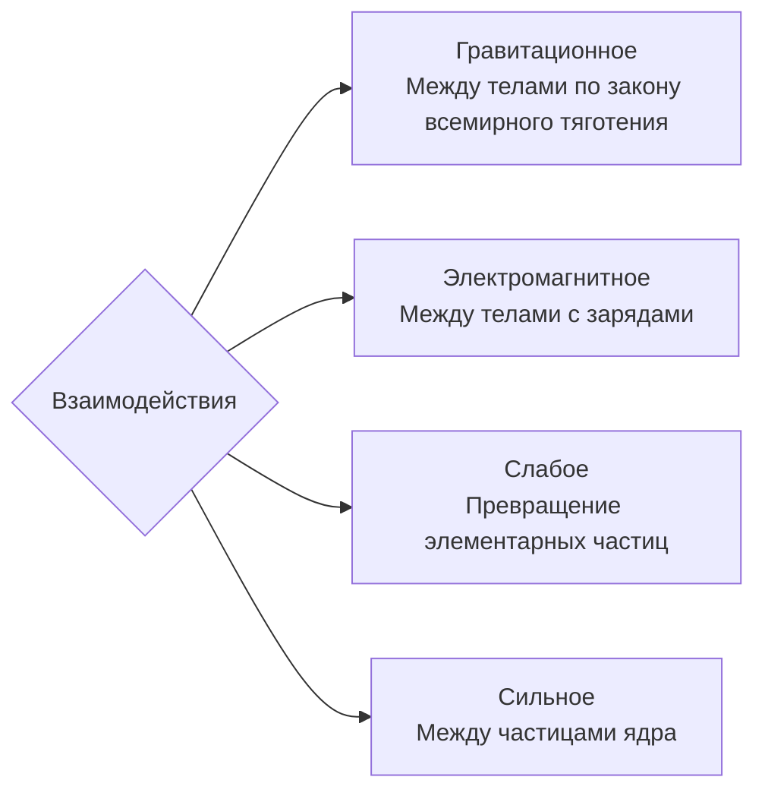

### Дополнения к кинематике 

Положение материальной точки задаётся двумя способами:
1. Через радиус вектор: $r = r(t)$
2. Через систему уравнений: $$\begin{align}x=f(t)&&y=\varphi(t)&&z=\omega(t)\end{align}$$
Пример. Пусть положения тела в плоскости задаётся так: $$\begin{align}x=a\sin\alpha t&&y=a\cos\alpha t\end{align}$$
Какой вид имеет траектория тела? Переведём в другой вид уравнение, возведя в квадрат и сложив: $$x^2+y^2=a^2$$
Значит, траектория выглядит как окружность

Виды движения:
- Плоское движение — это движение в одной плоскости
- Прямолинейное и криволинейное. В первом случае траекторией будет прямая
- Поступательное движение — конгруэтные траектории

Среднепутевая скорость при приближении времени к $0$ совпадает с мгновенной (скалярная скорость). Удобная для описания замкнутой траектории или с траекторией, где есть точки пересечения

$v$ — модуль мгновенной скорости
$\pmb{v}$ — вектор мгновенной
$a_\tau$ — тангенциальное (касательное ускорение), ответственное за изменение скорости
$a_n$ — нормальное ускорение
$a$ — модуль мгновенного ускорения
$\pmb a$ — мгновенное ускорение

|               | Равномерное движение                                                                        | Неравномерное движение                                                                                               |
| ------------- | ------------------------------------------------------------------------------------------- | -------------------------------------------------------------------------------------------------------------------- |
| Прямолинейное | $v=const$ $\pmb{v}=const$ $a_\tau = 0$ $a_n=0$ $a=0$ $\pmb{a}=0$             | $v\neq const$ $\pmb{v}\neq const$ $a_\tau \neq 0$ $a_n=0$ $a=a_\tau$ $\pmb{a}\neq0$                   |
| Криволинейное | $v=const$ $\pmb{v}\neq const$ $a_\tau = 0$ $a_n\neq0$ $a=a_n$ $\pmb{a}\neq0$ | $v\neq const$ $\pmb{v}\neq const$ $a_\tau \neq 0$ $a_n\neq0$ $a=\sqrt{a_\tau^2+a^2_n}$ $\pmb{a}\neq0$ |

Существует аналог ускорения для угловой скорости во вращения

### Дополнения к динамике
Существуют такие системы отсчета, относительно которых тело сохраняет свою скорость при компенсации внешних воздействий.
Такие системы называются инерциальными (связано с инерциальном движущимся телом отсчёта), как и движение свободной материальной точки в них

В неинерциальных системах (движется с ускорением относительно инерциальной) законы Ньютона не выполняются

Первый закон:
- Устанавливает существование инерциальных систем отсчёта
- Описывает характер движение свободной материальной точки в такой системе

Существуют две основные инерциальные системы отсчёта:
- Геоцентрическая (пренебрегается вращение земли вокруг солнца)
- Гелиоцентрическая — центр в солнце, а оси по условно неподвижным звёздам

##### Пример
На неподвижной тележке находится сосуд с водой, в котором плавает
деревянный брусок (а). Описать поведение бруска при прямолинейном равноускоренном движении тележки вправо, пользуясь двумя системами отсчёта:
1) Инерциальной, связанной с поверхностью, по которой движется тележка (б)
2) Неинерциальной, связанной с ускоренно движущейся тележкой (в)
![[Динамика— медиа 1.png]]
Из эксперимента известно, что брусок будет прижиматься к левой стенке сосуда.
В случае инерциальной системы отсчёта логику можно выстроить так:
1. Так как на брусок действуют силы тяжести и выталкивания, компенсирующие друг друга, а другими можно пренебречь, то фактически это свободное тело
2. В таком случае он либо покоится, либо движется с постоянной скоростью (движение свободного тела в ==инерциальной== системе отсчёта)
3. Тележка двигается с ускорением — её стенка ускоренно приближается к бруску

Во втором случае брусок без внешних воздействий равноускорено движется к стенке, а тележка покоится. Первый закон соответственно не выполняется
#### $II$ закон
При взаимодействии ускорение тела в инерциальной системе отсчёта прямо пропорционально равнодействующей силы, приложенной к телу, обратно пропорционально массе тела, и по направлению совпадает с силой
$$\vec{a}= \frac{\vec{F}}m$$

**Сила** — это физическая величина, которая является мерой воздействия одного тела на другое. Три основные параметра: точка приложения, направление, модуль

Линия действия силы — это прямая, вдоль которой направлена сила

Электромагнитные силы включают в себя силы трения и упругости

Внутренние силы — это силы между частями некоторой системы тел 
Внешние силы — это силы, действующие со стороны не включенных в систему тел
Системы изолирована, если нет внешних сил

Если на материальную точку одновременно действуют несколько сил, то они могут быть заменены равнодействующей силой $\Sigma F$. Считается по двум формулам: $$\begin{align}\Sigma F = \sqrt{\Sigma F_x^2 + \Sigma F_y^2}\text{ (кординаты вектора из сложения)} &&\Sigma F_x = \sum_{i=1}^n F_{ix}\text{ (проекции)}\end{align}$$

**Масса** (инертная) — это физическая величина, которая является мерой инертности (способности сохранять состояние данного тела)

Масса (гравитационная) — это физическая величина, характеризующая способность тел взаимодействовать по закону всемирного тяготения

Установлена высокая тождественность этих двух величин, которые в целом называются массой

В ньютоновской механике считается, что:
- Масса тела не зависит от скорости его движения
- Масса тела равна сумме масс всех частиц, из которого оно состоит
- Выполняется закон сохранения массы для совокупности тел: при любых процессах, происходящих в системе тел, её масса остается неизменной

Закон в такой форме справедлив:
- Когда масса тела в течение времени действия силы не изменяется
- Для поступательного движения для тела, не изменяющего массу и имеющего конкретные размеры (когда ускорение любой точки тела одинаково)

В более общей форме имеет вид, когда сила не изменяется: $$F = \frac{\Delta mv}{\Delta t}$$
Иначе уравнение записывается как: $$F \Delta t = \Delta p$$
В таком случае **импульс силы** — это произведение силы $F$ на промежуток времени $\Delta t$, в течение которого сила действовала на точку или тело; мера действия силы во времени и мерой изменения импульса точки (тела). Импульс силы равен изменению импульса точки (тела).

В такой форме справедлив при изменении массы от времени или скорости

**Принцип независимости действия сил** гласит, что если на материальную точку действуют несколько сил, то они по отдельности сообщают точке такое же ускорение, которое они сообщали бы без действия других сил 
#### $III$  закон Ньютона
Тела взаимодействуют в инерциальной системе отсчёта силами, равными по модулю и противоположными по направлению
$$\overrightarrow{F_{12}} =\overrightarrow{F_{21}}$$

#### Механический принцип относительности Галилея
Две произвольные инерциальные системы отсчета связаны друг с другом таким образом:
- Преобразование координат Галилея: $$\begin{align}x'=x-(x_0+u_xt)&& y'=y-(y_0+u_yt)&& z'=z-(z_0+u_zt)\end{align}$$
  Здесь:
  - $u$ —  скорость равномерного и прямолинейного движения одной системы относительно другой  
  - $r$ и $r'$ — координаты в одной и другой системе 
  - $r_0$ — координата центра одной системы относительно другой 
- Закон сложения скоростей в механике Ньютона: $$\begin{align}v_x'=v_x-u_x&&v_y'=v_y-u_y&&vzx'=v_z-u_z\end{align}$$
- Абсолютный характер ускорения во всех инерциальных системах отсчёта: $$\begin{align}a'_x=a_x&&a'_y=a_y&&a'_z=a_z\end{align}$$
- Механический принцип относительности: для любых механических явлений все инерциальные системы отсчета являются равноправными
![[Механический принцип относительности Галилея — медиа 1.png]]