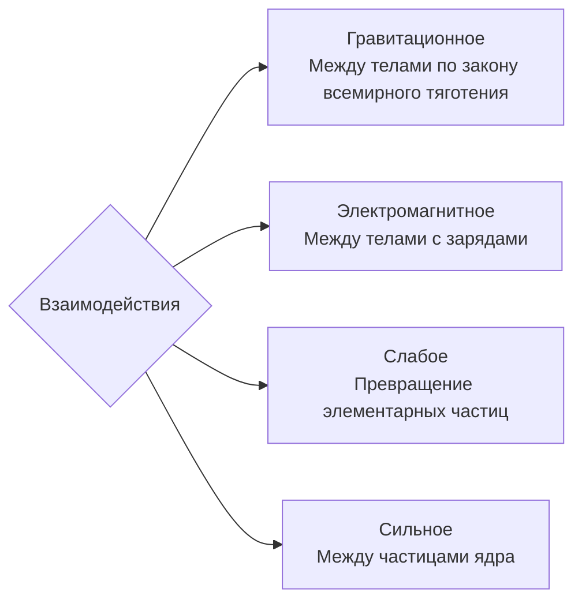

**Динамика** — это раздел физики, изучающий причины движения, то-есть силы; влияние взаимодействия между телами на их механическое движение
«Дина» — (лат.) сила

**Основная задача динамики**: определить положение тела в произвольный момент времени по известным начальному положению тела, начальной скорости и силам, действующим на тело.

Свободным или изолированным телом называются такие тела, на которые не действуют внешние силы и поля или они скомпенсированы

---
### Законы Ньютона
#### $I$ закон Ньютона
Существуют такие системы отсчета, относительно которых тело сохраняет свою скорость при компенсации внешних воздействий.
Такие системы называются инерциальными (связано с инерциальном движущимся телом отсчёта), как и движение свободной материальной точки в них

В неинерциальных системах (движется с ускорением относительно инерциальной) законы Ньютона не выполняются

Первый закон:
- Устанавливает существование инерциальных систем отсчёта
- Описывает характер движение свободной материальной точки в такой системе

Существуют две основные инерциальные системы отсчёта:
- Геоцентрическая (пренебрегается вращение земли вокруг солнца)
- Гелиоцентрическая — центр в солнце, а оси по условно неподвижным звёздам

##### Пример
На неподвижной тележке находится сосуд с водой, в котором плавает
деревянный брусок (а). Описать поведение бруска при прямолинейном равноускоренном движении тележки вправо, пользуясь двумя системами отсчёта:
1) Инерциальной, связанной с поверхностью, по которой движется тележка (б)
2) Неинерциальной, связанной с ускоренно движущейся тележкой (в)
![[Динамика— медиа 1.png]]
Из эксперимента известно, что брусок будет прижиматься к левой стенке сосуда.
В случае инерциальной системы отсчёта логику можно выстроить так:
1. Так как на брусок действуют силы тяжести и выталкивания, компенсирующие друг друга, а другими можно пренебречь, то фактически это свободное тело
2. В таком случае он либо покоится, либо движется с постоянной скоростью (движение свободного тела в ==инерциальной== системе отсчёта)
3. Тележка двигается с ускорением — её стенка ускоренно приближается к бруску

Во втором случае брусок без внешних воздействий равноускорено движется к стенке, а тележка покоится. Первый закон соответственно не выполняется
#### $II$ закон
При взаимодействии ускорение тела в инерциальной системе отсчёта прямо пропорционально равнодействующей силы, приложенной к телу, обратно пропорционально массе тела, и по направлению совпадает с силой
$$\vec{a}= \frac{\vec{F}}m$$

**Сила** — это физическая величина, которая является мерой воздействия одного тела на другое. Три основные параметра: точка приложения, направление, модуль

Линия действия силы — это прямая, вдоль которой направлена сила

Электромагнитные силы включают в себя силы трения и упругости

Внутренние силы — это силы между частями некоторой системы тел 
Внешние силы — это силы, действующие со стороны не включенных в систему тел
Системы изолирована, если нет внешних сил

Если на материальную точку одновременно действуют несколько сил, то они могут быть заменены равнодействующей силой $\Sigma F$. Считается по двум формулам: $$\begin{align}\Sigma F = \sqrt{\Sigma F_x^2 + \Sigma F_y^2}\text{ (кординаты вектора из сложения)} &&\Sigma F_x = \sum_{i=1}^n F_{ix}\text{ (проекции)}\end{align}$$

**Масса** (инертная) — это физическая величина, которая является мерой инертности (способности сохранять состояние данного тела)

Масса (гравитационная) — это физическая величина, характеризующая способность тел взаимодействовать по закону всемирного тяготения

Установлена высокая тождественность этих двух величин, которые в целом называются массой

В ньютоновской механике считается, что:
- Масса тела не зависит от скорости его движения
- Масса тела равна сумме масс всех частиц, из которого оно состоит
- Выполняется закон сохранения массы для совокупности тел: при любых процессах, происходящих в системе тел, её масса остается неизменной

Закон в такой форме справедлив:
- Когда масса тела в течение времени действия силы не изменяется
- Для поступательного движения для тела, не изменяющего массу и имеющего конкретные размеры (когда ускорение любой точки тела одинаково)

В более общей форме имеет вид, когда сила не изменяется: $$F = \frac{\Delta mv}{\Delta t}$$
Иначе уравнение записывается как: $$F \Delta t = \Delta p$$
В таком случае **импульс силы** — это произведение силы $F$ на промежуток времени $\Delta t$, в течение которого сила действовала на точку или тело; мера действия силы во времени и мерой изменения импульса точки (тела). Импульс силы равен изменению импульса точки (тела).

В такой форме справедлив при изменении массы от времени или скорости

**Принцип независимости действия сил** гласит, что если на материальную точку действуют несколько сил, то они по отдельности сообщают точке такое же ускорение, которое они сообщали бы без действия других сил 
#### $III$  закон Ньютона
Тела взаимодействуют в инерциальной системе отсчёта силами, равными по модулю и противоположными по направлению
$$\overrightarrow{F_{12}} =\overrightarrow{F_{21}}$$

----
### Силы

#### **Закон всемирного тяготения** 
Закон всемирного тяготения выражается формулой: $$F = G\frac{M m}{r^2}$$
Здесь $G$ — гравитационная постоянная, равная $6.67\cdot10^{-11}$. Фактически это величина,  равная взаимодействию двух тел массой 1 кг на расстоянии 1 м: $$G =\frac{F\cdot r^2}{Mm}$$
#### Вес тела
**Вес тела** ($P$) — это сила, с которой тело вследствие притяжения к Земле действует на опору или подвес. Если:
1) Опора или подвес неподвижны, то $P = F_{тяж}$
2) Опора движется вниз, то $P = m(g-a)$. Вес тела равен $0$ при $g=a$ или невесомость
3) Опора движется вверх, то $P = m(g+a)$. Здесь появляется перегрузка ($P_{покоя} < P$)
#### Расчёт $g$
Ускорение свободного падения высчитывается для планет через равенство силы тяжести и силы тяготения, которое приводит нас к формуле: $$g = G\frac{M_п}{(R_п+h)^2}$$
#### Космические скорости
Первая космическая скорость — это скорость, которую необходимо развить телу для движения вокруг планеты. Рассчитывается через второй закон Ньютона и равенство силы тяготения на центростремительное ускорение: $$v_I=\sqrt{G\frac{M_п}{R+h}}$$

---
#### Силы упругости
**Силы упругости** — это силы, возникающие при упругой деформации тел.
Сила упругости, действующая со стороны опоры или подвеса, в данной задаче называется **силой реакции опоры** или **силой натяжения подвеса**.

Закон Гука характеризует одномерное сжатие или растяжение: $$F_{упр}=-k\Delta l$$

---
#### Силы трения
Трение подразделяется на:
1. Внутреннее и внешнее
2. Сухое, жидкое или вязкое

Сила трения направлена вдоль поверхностей соприкасающихся тел и противоположна скорости их относительного перемещения

Сухое трение подразделяется на:
- Трение покоя — трение при отсутствия перемещения тел. Она препятствует возникновению движения. Движения возникает, когда внешней силе удается преодолеть предельную силу трения покоя. Так как эта сила возникает из-за зацепления молекул, неровностей поверхности, то можно сказать, что она  относится к разновидностям проявления сил упругости. Считается по формуле:$$F_{тр}=\mu N$$
- Трение скольжения
- Трение качения
