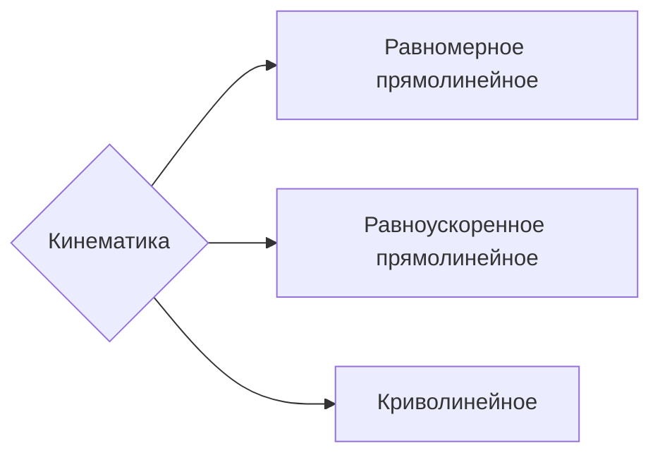

**Кинематика** — это раздел физики, изучающий математическое описание движения тел без причин этого движения

-----------

**Равномерное прямолинейное движение** — это движение, при котором тело за равные промежутки времени проходит равные перемещения

В таком случае скорость может быть вычислена: $$\begin{align}\vec{v} = \frac{\vec{S}}{t}&&v_x=\frac{S_x}{t}\end{align}$$
Но так же путь может быть представлен в виде $S_x = x-x_0$, а в таком случае перемещение в формуле может быть заменено
![[Механика — медиа 2.png]] 
$v_x = \dfrac{S_x}{\Delta t} = \dfrac{x-x_0}{\Delta t} = \dfrac{\Delta x}{\Delta t}$ — из этой формулы мы получаем определение **скорости**: 
\
изменение координаты за единицу времени

В таком случае **уравнение прямолинейного равномерного движения** есть$x(t) = x_0 + v_xt$ из прошлой формулы, выражая $x$

Графики:

| Проекция скорости | ![[Механика — медиа 3.png]] |
| ----------------- | --------------------------- |
| **Проекция пути** | ![[Механика — медиа 4.png]] |
| **Координаты**    | ![[Механика — медиа 5.png]] |

---
**Равноускоренное прямолинейное движение** — это движение, при котором за равные промежутки времени тело изменяет свою скорость одинаково

Центральным понятием становится ускорение: $$\vec{a} = \frac{\vec{v}-\vec{v_0}}{t}=\frac{\Delta\vec{v}}{\Delta t}$$
**Ускорение** — это изменение скорости за единицу времени.

Из формулы ускорения можно получить *формулу скорости*: $$v = v_0+at$$
*Формула пройденного пути* получается из площади под графиком функции скорости и с помощью подстановки получает ещё две форму: $$\begin{align}S = \frac{v_0+v}{2}\cdot t&&S=v_0t+\frac{at^2}{2}&&S = \frac{v^2-v_0^2}{2a}\end{align}$$
Получаем **уравнение прямолинейного равноускоренного движения**: $$x = x_0+S = x_0+v_0t+\frac{at^2}{2}$$
Графики: 

| Проекция ускорения    | ![[Механика — медиа 6.png]] |
| --------------------- | ------------------------------------ |
| **Проекция скорости** | ![[Механика — медиа 7.png]] |
| **Путь**              | Парабола                             |
| **Координата**        | Парабола со смещением                |

----
Средняя скорость неравномерного движения — это относительное изменение её координаты $\Delta x$ к интервалу $\Delta t$, в течение которого эти измерения происходят. Вычисляется как:  $$\overline{v} = \frac{\Delta x}{\Delta t}$$
Мгновенная скорость определяется как: $$v_x=\lim_{\Delta t\to0}\frac{\Delta x}{\Delta t}=\frac{\delta x}{\delta t}\text{ (производная координаты по времени)}$$
Мгновенная скорость при прямолинейном движении — это предел, к которому стремится отношение изменения координаты точки к интервалу времени, за которое это изменение произошло, если интервал времени стремится к нулю

Ускорением называется предел отношения изменения скорости $\Delta\vec{v}$  промежутку времени $\Delta t$, в течение которого изменение произошло, если $\Delta t \to 0$: $$\vec{a}=\lim_{\Delta t \to 0}\frac{\Delta \vec{v}}{\Delta t}$$

---------
Свободное падение — это падение под действием одной лишь силы тяжести

Ускорение свободного падения показывает изменение скорости за каждую секунду

---
Движение под углом к горизонту.

Траектория движения идёт по параболе. 

Скорость составляется из двух скоростей: по оси $x$ и по оси $y$: $$\left\{\begin{align}&\vec{v}=\overrightarrow{v_{x}}+\overrightarrow{v_{y}}\\\\&v^2=v_x^2+v_y^2\end{align}\right.$$
Здесь $v_y$ рассматривается как движение при свободном падении, а $v_x$ — равномерное. Из этого следует: $$\begin{align}v_y = v_{0y}-gt&&v_x=v_{0x}=\text{const}\end{align}$$
В то же время: $$\left\{\begin{align}&v_{0x}=v_0\cdot \cos \alpha\\\\&v_{0y}=v_0\cdot\sin\alpha\end{align}\right.$$

Из $v_y = 0$ в максимальной точке подъема следует:
Тело потратит на путь: $$t=\frac{2v_{0y}}{g}$$
А максимальная высота: $$H = \frac{v_{0y}^2}{2g}=v_{0y}\frac{t}{2}-\frac{gt^2}{8}$$
В случае движения тело, брошенного горизонтально всё похоже, но начальная скорость по вертикали равна 0, а время вычисляется как: $$t=\sqrt{\frac{2H}g}$$

