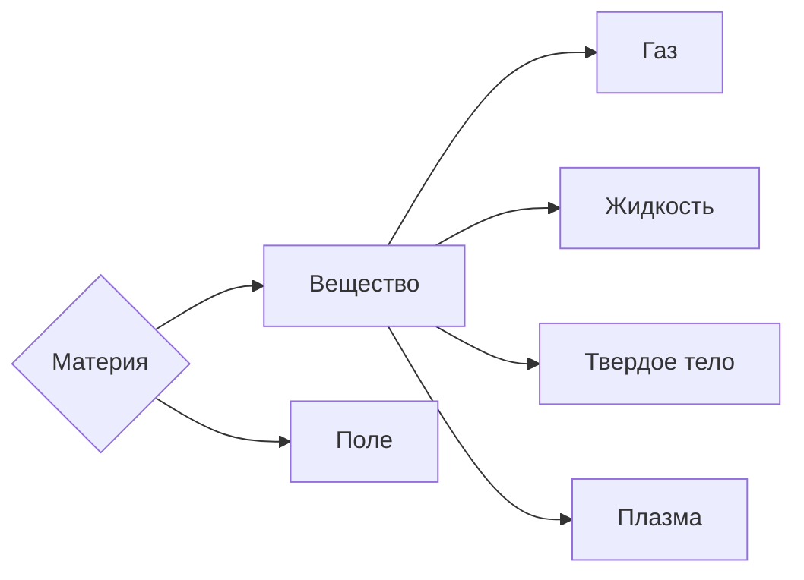

Определения физики:
- **Физика** — наука о природе
- **Физика** — наука, изучающая явления или изменения в неживой природе

С древнегреческого «физис» переводится как природа

Изучение происходит во Вселенной, состоящей из материи, которая бывает:
- Веществом
- Полем 

\*Понятие поля введено Фарадеем

**Тело** — это область пространства, ограниченная веществом

Физические явления:
- Световое — оптика 
- Звуковое — акустика
- Тепловые — термодинамика
- Механическое — механика
- Электромагнитное — электродинамика

---
## Научный метод познания мира
*Наблюдение* — это исследование явления без создания для этого специальных условий 

*Гипотеза* — предположение или обобщение результатов наблюдения

*Эксперимент* — это исследование явления в специально созданных условиях

*Физический закон* — устойчивая, повторяющаяся объективная закономерность в природе

*Теория* — это количественное описание физического явления

----

## Физические величины и способ их измерения
**Физическая величина** — это физическое понятие, выраженное числом. Она существует только тогда, когда её можно измерить.

**Физическое измерение** — это сравнение физической величины с чем-то постоянным, принятым за эталон 

### Теория погрешности
Точность физической величины (диапазон, в котором лежит истинное значение) задаётся с помощью значащих цифр
На схеме видна запись: $$P = \overbrace{\underbrace{34.2}_2\underbrace{8}_3}^1 \pm 0.005\text{ см}$$
Здесь:
- 1 — значащие цифры
- 2 — истинные цифры
- 3 — сомнительная цифра
- Точность определяется половиной последнего разряда

Погрешности имеют свою классификацию:
- По происхождению: системная (приборы), случайная (среда), промах (например, отсчет на линейке с 1, а не с 0)
- По смыслу в таблице ниже

| Абсолютная                                                                                                   | Относительная                                                                                              |
| ------------------------------------------------------------------------------------------------------------ | ---------------------------------------------------------------------------------------------------------- |
| $x_\Delta =\|x - x_0\|$ $x_\Delta$ — граница погрешности $x$ — истинное значение $x_0$ — измеренное | $\epsilon x = \frac{\Delta x}{x_0}$  $\Delta x$ — абсолютная погрешность $x_0$ — измеренное значение |

Погрешность измерительного прибора равна его цене деления
